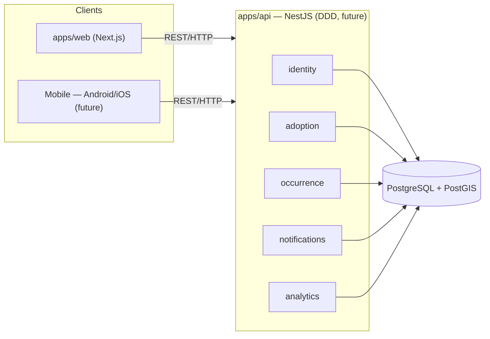

<div align="center">

# ANIMAPS

**Responsible adoption platform and animal occurrence map.**

Ideal match between guardians and animals + georeferenced reports — care and technology in one place.

[](https://nextjs.org/)
[](https://react.dev/)
[](https://www.typescriptlang.org/)
[](https://tailwindcss.com/)
[](https://nestjs.com/)
[](https://www.postgresql.org/)
[](https://pnpm.io/)
[](#license)

</div>

---

## Contents

- [About](#about)
- [Current status](#current-status)
- [Architecture](#architecture)
- [Tech stack](#tech-stack)
- [Repository structure](#repository-structure)
- [Getting started](#getting-started)
- [Scripts](#scripts)
- [Design system](#design-system)
- [Documentation](#documentation)
- [Contribution](#contribution)
- [License](#license)

---

## About

ANIMAPS connects people who care for animals:

| Audience | Role |
|---|---|
| **Guardians / adopters** | Profile + **ideal match** with available animals |
| **NGOs** | Animal listings and adoption requests without spreadsheets |
| **Clinics** | Verified partners in responsible adoption |
| **Public agencies / research** | Aggregated indicators |
| **Community** | Georeferenced occurrence map (with or without an account) |

**Differentiators:** ideal match (not an infinite feed), anonymous-capable occurrence map, verified NGO/clinic profiles, LGPD consent by design.

---

## Current status

| Phase | Scope | Status |
|---|---|---|
| **Phase 0** | Architecture, data model, permissions, LGPD, governance | Done |
| **Phase 1** | Institutional landing + waitlist (`apps/web`) + onboarding/dashboard shells (frontend mocks) | In progress |
| **Phase 2** | NestJS API (DDD) + auth + real persistence | Scaffolded (`@animaps/api`: health + waitlist); auth pending |
| **Phase 3** | Full web product (matching, map, dashboards) | Planned |
| **Phase 4** | Mobile apps (Android/iOS) on the same API | Planned |

---

## Architecture

DDD backend (planned), MVC on the web view layer, **pnpm** monorepo. Web first; mobile later on the same API.



Details: [`docs/bounded-contexts.md`](docs/architecture/bounded-contexts.md) · data model: [`docs/der.dbml`](docs/database/der.dbml), [`docs/schema.prisma`](docs/database/schema.prisma) · evolution: [`docs/schema-evolution.md`](docs/database/schema-evolution.md).

**Naming:** English in code and DB (`camelCase` API / `snake_case` DB); UI in **Portuguese (default) + English + Spanish** via client dictionaries (no `/en` or `/es` routes).

---

## Tech stack

### Frontend (`apps/web`)

| Area | Tech |
|---|---|
| Framework | [Next.js](https://nextjs.org/) 16 (App Router) |
| Language | [TypeScript](https://www.typescriptlang.org/) 5 |
| UI | [React](https://react.dev/) 19 |
| Style | [Tailwind CSS](https://tailwindcss.com/) 4 |
| Motion | [GSAP](https://gsap.com/) + Lenis |
| Icons | [lucide-react](https://lucide.dev/) |
| Imagery | Clay mascots (`next/image`) |

### Backend & data (planned)

| Area | Tech |
|---|---|
| Framework | [NestJS](https://nestjs.com/) (DDD) |
| ORM | [Prisma](https://www.prisma.io/) |
| DB | [PostgreSQL](https://www.postgresql.org/) + [PostGIS](https://postgis.net/) |
| Auth | JWT + hashed refresh tokens |

### Infra

| Area | Tech |
|---|---|
| Monorepo | [pnpm](https://pnpm.io/) workspaces (`apps/*`) |
| Web deploy | [Vercel](https://vercel.com/) |
| CI | GitHub Actions (planned) |
| Analytics | GA4 after cookie consent |

---

## Repository structure

```text
animaps/
├── apps/
│   ├── web/                         # @animaps/web — Next.js
│   │   └── src/
│   │       ├── app/                 # routes, layout, providers, API routes
│   │       │   └── api/waitlist/    # temporary; cut over to Nest when ready
│   │       ├── features/
│   │       └── components/
│   └── api/                         # @animaps/api — NestJS + Prisma
│       ├── prisma/schema.prisma
│       └── src/modules/{health,marketing,identity}
├── docs/
├── package.json
└── pnpm-workspace.yaml              # apps/* (packages/ when 2+ consumers need them)
```

---

## Getting started

**Prerequisites:** Node.js 20+, pnpm 10+ (`corepack enable`).

```bash
git clone <repo-url>
cd animaps
pnpm install
pnpm dev
```

Web: [http://localhost:3000](http://localhost:3000).

API (optional Wave 2):

```bash
docker compose up -d
cp .env.example .env   # or apps/api/.env.example → apps/api/.env
pnpm prisma:generate
pnpm prisma:migrate
pnpm dev:api
```

API: [http://localhost:3001/health](http://localhost:3001/health). See [`apps/api/README.md`](apps/api/README.md).

Web env: [`apps/web/.env.example`](apps/web/.env.example). DB secrets: root [`.env.example`](.env.example) / [`apps/api/.env.example`](apps/api/.env.example).

---

## Scripts

| Command | Description |
|---|---|
| `pnpm dev` | Start `@animaps/web` |
| `pnpm dev:api` | Start `@animaps/api` (watch) |
| `pnpm build` | Build all workspace apps |
| `pnpm lint` | Lint all workspace apps |
| `pnpm typecheck` | Recursive typecheck |
| `pnpm prisma:generate` | Generate Prisma client |
| `pnpm prisma:migrate` | Run Prisma migrate (API) |
---

## Design system

Shared primitives in `apps/web/src/components/`: `Button`, `Input`, `Select`, `Checkbox`, `AccordionItem`, `Toast`, `LocaleSwitcher`, plus product UI (`CodeInput`, `Modal`, `SelectableCard`, `InterestTag`, `ProgressIndicator`, `FormSection`, …). Motion kit in `components/bits/`. Clay mascots: `features/landing` (`ClayFigure`) + assets in `apps/web/public/images/clay/`.

Tokens: [`apps/web/src/app/globals.css`](apps/web/src/app/globals.css) (includes semantic `--success` / `--warning` / `--error`). Visual brief: [`docs/landing-design-brief.md`](docs/features/landing/landing-design-brief.md) · [`docs/design-system.md`](docs/features/design-system.md).

---

## Documentation

All product, domain, and process docs live in [`docs/`](docs/). Full index: [`docs/README.md`](docs/README.md).

<details>
<summary><strong>Domain & data</strong></summary>

| Doc | Content |
|---|---|
| [architecture.md](docs/architecture.md) | Monorepo boundaries, web/mobile/API roadmap |
| [overview.md](docs/domains/overview.md) | Ecosystem layers: PERSON / ORGANIZATION / INSTITUTION + Case |
| [api.md](docs/api/overview.md) | REST contract (identity + waitlist + onboarding) |
| [bounded-contexts.md](docs/architecture/bounded-contexts.md) | DDD contexts |
| [database.md](docs/database/overview.md) | OnboardingDraft → tables map + Wave 2 freeze |
| [schema-evolution.md](docs/database/schema-evolution.md) | How to change the DB safely |
| [der.dbml](docs/database/der.dbml) | ER diagram — paste into [dbdiagram.io](https://dbdiagram.io) (not Prisma) |
| [data-dictionary.md](docs/database/data-dictionary.md) | Fields, types, rules |
| [schema.prisma](docs/database/schema.prisma) | Prisma draft (docs only until API) |
| [permissions-matrix.md](docs/security/permissions-matrix.md) | Roles and actions |
| [personas.md](docs/roadmap/personas.md) | Product personas |

</details>

<details>
<summary><strong>Product UX (onboarding & app shell)</strong></summary>

| Doc | Content |
|---|---|
| [user-flow.md](docs/features/user-flow.md) | Signup → onboarding → dashboard |
| [authentication.md](docs/features/authentication.md) | Email OTP UI |
| [onboarding.md](docs/features/onboarding.md) | Progressive steps |
| [verification.md](docs/features/verification.md) | Selfie verification |
| [profile.md](docs/domains/profiles.md) | Optional profile fields |
| [dashboard.md](docs/features/dashboard.md) | App chrome & home |
| [matching.md](docs/domains/matching.md) | Discover mocks & future match |
| [roadmap.md](docs/roadmap/roadmap.md) | Product phases 01–09 |
| [design-system.md](docs/features/design-system.md) | Tokens & states |
| [components.md](docs/features/components.md) | Shared UI catalog |

</details>

<details>
<summary><strong>Landing (Phase 1)</strong></summary>

| Doc | Content |
|---|---|
| [landing-content-brief.md](docs/features/landing/landing-content-brief.md) | Goals, audiences, tone, sections |
| [landing-design-brief.md](docs/features/landing/landing-design-brief.md) | Palette, type, motion, UI |
| [landing-tech-plan.md](docs/features/landing/landing-tech-plan.md) | Stack, form, SEO, deploy |

</details>

<details>
<summary><strong>Privacy & process</strong></summary>

| Doc | Content |
|---|---|
| [lgpd-checklist.md](docs/security/lgpd-checklist.md) | Minimum LGPD checklist for MVP |
| [privacy-policy-draft.md](docs/security/privacy-policy-draft.md) | Internal privacy draft (consumer PT copy may follow) |
| [git-and-ci.md](docs/infrastructure/git-and-ci.md) | Branches, Conventional Commits, CI |
| [pilot-ngo.md](docs/roadmap/pilot-ngo.md) | Pilot NGO selection/onboarding |
| [ui-patterns.md](docs/features/ui-patterns.md) | Toasts, language, auth chrome |

</details>

---

## Contribution

See [`docs/git-and-ci.md`](docs/infrastructure/git-and-ci.md):

- **Branches:** `main` · `develop` · `feature/<slug>` · `hotfix/<slug>`
- **Commits:** [Conventional Commits](https://www.conventionalcommits.org/)
- **Package manager:** `pnpm` only
- **CI:** PR needs green `lint` + `typecheck` + `build`

```text
feat(adoption): add RequestAdoption use case
fix(occurrence): allow null userId for anonymous reports
docs: update LGPD checklist
```

---

## License

Private project — license TBD.
