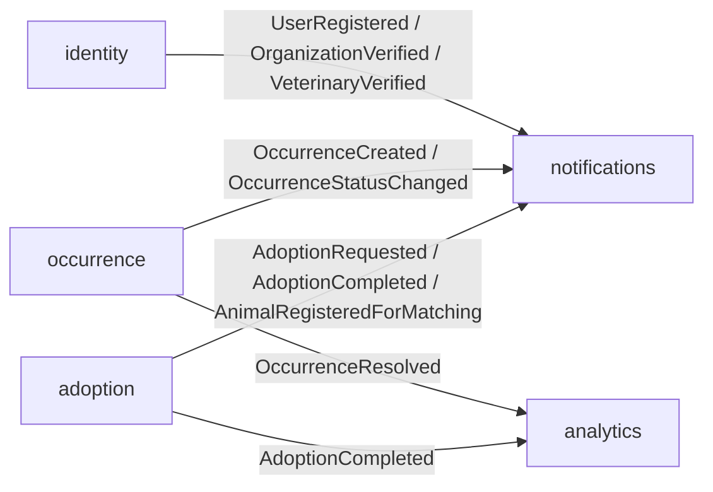

# ANIMAPS — Bounded Contexts

NestJS modular monolith (DDD). Overview: [`architecture.md`](../architecture.md) · REST: [`api.md`](../api/overview.md). DER: [`der.dbml`](../database/der.dbml). Dictionary: [`data-dictionary.md`](../database/data-dictionary.md). Evolution: [`schema-evolution.md`](../database/schema-evolution.md). Permissions: [`permissions-matrix.md`](../security/permissions-matrix.md).

**Target folders:** `apps/api/src/modules/<context>/` with `domain/`, `application/`, `infrastructure/`, `interfaces/http/`.

---

## Closed domain decisions

| Decision | Detail |
|---|---|
| Cross-context integration | In-process domain events (NestJS pub/sub). BullMQ later. |
| Who creates `Animal` | Verified `ong`, verified `veterinary_clinic`, or `person` with `isRescuer = true` |
| `Occurrence` registration | Anonymous allowed (`userId` nullable). `ClaimOccurrence` links later. IP rate limit (Phase 4). |
| Validate Occurrence | NGO verified / `public_agency`; `biologist` only for `wildlife_sighting` |
| Parallel adoption | Many requests per animal; origin chooses; `in_process` on first `approved` |
| Person `taxId` | Optional at signup; required for `RequestAdoption` |
| Soft delete | `User.deletedAt`, `Animal.deletedAt` — see [`schema-evolution.md`](../database/schema-evolution.md) |

---

## Context map

| Context | Folder | Entities | Role |
|---|---|---|---|
| `identity` | `modules/identity/` | `User`, profiles, intentions, prefs, verification, `AuthIdentity`, tokens | Accounts, onboarding persist, auth, institutional verification, push tokens |
| `adoption` | `modules/adoption/` | `Animal`, `Adoption` | Animal listing, matching, adoption flow |
| `occurrence` | `modules/occurrence/` | `Occurrence`, `OccurrenceFollower`, `OccurrenceReport` | Geo occurrences, moderation, claim, reports |
| `notifications` | `modules/notifications/` | `Notification` | Preferences, delivery, history |
| `analytics` | `modules/analytics/` | (reads/aggregations only in MVP) | KPIs, anonymized export |
| `marketing` | `modules/marketing/` (Wave 2) | `WaitlistEntry` | Landing waitlist (today: Next `/api/waitlist`) |

`AuditLog` is **cross-cutting** (shared port): written by `identity`, `occurrence`, `analytics`, and future `cases` / `institutions` on sensitive actions — not its own bounded context in the MVP.

Future ecosystem contexts (docs only until cutover): `organizations`, `institutions`, `cases` — see [overview.md](../domains/overview.md) · [cases.md](../domains/cases.md). Today's `occurrence` module remains for the geo map MVP; `Case` supersedes it for institutional routing.

`identity` is the **source of truth** for users and profiles. Other contexts reference `userId` / `organizationId` / `personId` / `veterinaryId` **without** duplicating profile data.

---

## Integration (in-process events)



| Event | Published by | Consumed by |
|---|---|---|
| `UserRegistered` | `identity` | `notifications` |
| `OrganizationVerified` | `identity` | `notifications` |
| `VeterinaryVerified` | `identity` | `notifications` |
| `AdoptionRequested` | `adoption` | `notifications` |
| `AdoptionCompleted` | `adoption` | `notifications`, `analytics` |
| `AnimalRegisteredForMatching` | `adoption` | `notifications` (may emit `NewCompatibleAnimalAvailable` — matching detail Phase 3) |
| `OccurrenceCreated` | `occurrence` | `notifications` |
| `OccurrenceStatusChanged` | `occurrence` | `notifications` |
| `OccurrenceResolved` | `occurrence` | `analytics` |

`notifications` and `analytics` **only consume** in the MVP — they do not publish write-side domain events.

Rule: a context **must not** import another context’s domain classes. Communicate via events or ID reads + ports (e.g. “is this `userId` a verified NGO?” via an `identity` query/port).

---

## 1. `identity`

### Goal

Identity, auth, profile authorization, institutional verification.

### Ubiquitous language

- **User** — authenticable account with a `user_type` (`UserType` enum)
- **Person** — adopter/caretaker (`PERSON`); may be **rescuer** (`isRescuer`) via `PersonProfile`
- **Organization (ONG)** — institution (`ONG`); needs **verified** for privileged actions via `OrganizationProfile`
- **Veterinary clinic** — partner clinic (`VETERINARY_CLINIC`) via `VeterinaryProfile`
- **Other** — catch-all public signup (`OTHER`) via `OtherProfile`
- **Public agency / Biologist** — admin-assigned types for validation and aggregated-data roles

Legacy names: `GuardianProfile` → `PersonProfile`, `NgoProfile` → `OrganizationProfile`, `ClinicProfile` → `VeterinaryProfile`. See [user-types.md](../domains/user-types.md).

### Entities

- `User` (soft delete via `deletedAt`; carries `user_type`, `account_status`, consent + policy version)
- `PersonProfile` (`isRescuer`)
- `OrganizationProfile` / `VeterinaryProfile` (`verified`; `companyTaxId` nullable until verification)
- `OtherProfile` (role metadata for `OTHER`)
- `UserIntention`, `Interest` / `UserInterest`, `AnimalPreference`, `UserLocation`, `UserProfileField`, `VerificationRequest`
- `AuthIdentity`, `RefreshToken`, `EmailVerificationToken`, `PasswordResetToken` (hash only)
- `DevicePushToken` (APNs/FCM — mobile Wave 3)
- `NotificationPreference`

### Main use cases

| Use case | Description |
|---|---|
| `RegisterUser` | Signup with `user_type` + LGPD consent |
| `LoginUser` | Issues access + refresh |
| `RefreshAccessToken` | Rotates access via valid refresh |
| `RevokeRefreshToken` / `LogoutUser` | Revokes refresh |
| `VerifyEmail` | Consumes `EmailVerificationToken` |
| `RequestPasswordReset` / `ResetPassword` | `PasswordResetToken` flow |
| `UpdatePersonProfile` | Preferences + `isRescuer` |
| `UpdateOrganizationProfile` / `SubmitOrganizationDocuments` | Institutional data |
| `VerifyOrganization` | Manual approval → `OrganizationVerified` + `AuditLog` |
| `UpdateVeterinaryProfile` | Services and hours |
| `SubmitVeterinaryDocuments` / `VerifyVeterinary` | Manual approval → `VeterinaryVerified` + `AuditLog` |
| `SaveOnboarding` | Upsert intentions / prefs / interests / profile fields / locations (`PUT /me/onboarding`) |
| `DeleteAccount` | Soft-delete + right to be forgotten + `AuditLog` (hard purge PII at T+90d) |
| `RegisterDevicePushToken` | Upsert `DevicePushToken` (Wave 3) |

### Anti-boundaries

- No compatibility scoring
- No lifecycle of `Animal` / `Adoption` / `Occurrence`
- No direct email send (emits event; infra/notifications dispatches)

### Dependencies

- **Publishes:** `UserRegistered`, `OrganizationVerified`, `VeterinaryVerified`
- **Consumes:** none (root)

---

## 2. `adoption`

### Goal

Available animals, compatibility matching, adoption request/approval.

### Ubiquitous language

- **Animal** — individual listed for adoption (soft delete via `deletedAt`)
- **Adoption** — process between person and animal origin
- **Compatibility score** — 0–100 at request time
- **Rescuer** — person allowed to register animals (`PersonProfile.isRescuer`)

### Entities

- `Animal` (origin: `organizationId` and/or `personId` and/or `veterinaryId`)
- `Adoption`

### Who may create `Animal`

| Actor | Condition |
|---|---|
| `ong` | `OrganizationProfile.verified = true` |
| `veterinary_clinic` | `VeterinaryProfile.verified = true` |
| `person` | `PersonProfile.isRescuer = true` |

**Parallel requests:** multiple `Adoption` in `requested` / `under_review` allowed; origin chooses. Animal → `in_process` on first `approved` (not on `requested`).

**`RequestAdoption`:** authenticated person with `taxId` set.

### Main use cases

| Use case | Description |
|---|---|
| `RegisterAnimal` | Initial CRUD + photo URLs → `AnimalRegisteredForMatching` |
| `UpdateAnimal` / `ArchiveAnimal` | Edit; owner only |
| `ListAvailableAnimals` | Filters; exclude `in_process` / `adopted` from new search |
| `CalculateCompatibility` | MatchingService (weighted rules) |
| `RequestAdoption` | Creates `Adoption` + score → `AdoptionRequested` |
| `ReviewAdoption` | Approve / refuse / request more info |
| `CompleteAdoption` | Final status + animal `adopted` → `AdoptionCompleted` |
| `CancelAdoption` | Cancel by interested party |

### Anti-boundaries

- Does not authenticate (queries `identity` via port/guard)
- Does not record geo occurrences
- Does not persist notification preferences

### Dependencies

- **Reads:** `identity` (role, `verified`, `isRescuer`, guardian prefs for matching)
- **Publishes:** `AdoptionRequested`, `AdoptionCompleted`, `AnimalRegisteredForMatching`
- **Consumes:** none required in MVP

---

## 3. `occurrence`

### Goal

Territorial tracking of fauna situations (domestic and wildlife).

### Ubiquitous language

- **Occurrence** — georeferenced record
- **Anonymous report** — occurrence without `userId`
- **Claim** — link anonymous occurrence to authenticated `User`
- **Validation** — truth seal by NGO / public agency
- **Follower** — org/user following the occurrence (N:N)

### Entities

- `Occurrence` (`userId` **nullable**)
- `OccurrenceFollower`
- `OccurrenceReport` (spam / duplicate / fraud)

### Main use cases

| Use case | Description |
|---|---|
| `RegisterOccurrence` | GPS or map pin; optional `userId` |
| `ClaimOccurrence` | Attach `userId` to anonymous occurrence |
| `UpdateOccurrenceStatus` | `open` → `in_progress` → `resolved` / `invalid` |
| `ValidateOccurrence` | Sets `validatedBy` — NGO verified / public_agency; biologist only if `wildlife_sighting` → `AuditLog` |
| `FollowOccurrence` | Add follower (same role rules as validate for wildlife) |
| `ListOccurrencesNearby` | Spatial query (`ST_DWithin`) via PostGIS |
| `ReportFalseOccurrence` | Creates `OccurrenceReport` |

### Anti-boundaries

- No adoption matching
- No KPI aggregation (`analytics`)
- Rate limiting and EXIF are **infrastructure**, not pure domain

### Dependencies

- **Reads:** `identity` (validator/follower roles)
- **Publishes:** `OccurrenceCreated`, `OccurrenceStatusChanged`, `OccurrenceResolved`
- **Consumes:** none required in MVP

---

## 4. `notifications`

### Goal

Preferences, dispatch, and in-app notification history (email/push later).

### Entities

- `Notification`
- Push delivery uses `identity.DevicePushToken` (Wave 3)

### Main use cases

| Use case | Description |
|---|---|
| `CreateNotification` | Persist from event handler |
| `ListUserNotifications` | Inbox |
| `MarkNotificationRead` | Mark read |
| `UpdateNotificationPreferences` | Lean MVP / Phase 6 |

### Event handlers

| Event | Action |
|---|---|
| `UserRegistered` | Welcome / verify email |
| `OrganizationVerified` / `VeterinaryVerified` | Institution unlocked |
| `AdoptionRequested` | Notify NGO/origin |
| `AdoptionCompleted` | Notify parties |
| `AnimalRegisteredForMatching` | Compatible guardians → `NewCompatibleAnimalAvailable` (Phase 3) |
| `OccurrenceCreated` | Notify NGOs/agencies in area (when area modeled) |
| `OccurrenceStatusChanged` | Notify author if `userId` present |

### Anti-boundaries

- Does not change adoption/occurrence status
- Does not compute KPIs

### Dependencies

- **Publishes:** none (MVP)
- **Consumes:** events above

---

## 5. `analytics`

### Goal

Aggregated KPIs and anonymized export for NGOs, researchers, public sector.

### MVP entities

No write-side domain table. Reads via queries/materialized views over `adoption` and `occurrence`.

### Main use cases

| Use case | Description |
|---|---|
| `GetAdoptionKpis` | Counts, avg time, avg score |
| `GetOccurrenceKpis` | By type/region/period |
| `GetRegionalHeatmapData` | Aggregates for heat map |
| `ExportAnonymizedDataset` | CSV/JSON without PII → `AuditLog` (`data_exported`) |

### Anti-boundaries

- Does not create adoptions/occurrences
- Does not send notifications
- Never exposes exact coordinates + identity together

### Dependencies

- **Publishes:** none
- **Consumes:** `AdoptionCompleted`, `OccurrenceResolved` (cache invalidate / recalc — or periodic job, Phase 5)

---

## 6. `marketing` (Wave 2)

### Goal

Landing waitlist leads (`WaitlistEntry`). Today owned by Next Route Handler; moves to Nest `marketing` in Wave 2.

### Entity

- `WaitlistEntry` — name, email, profile type, optional city/state, LGPD consent timestamp

---

## Cross-context dependencies (summary)

```
identity ──(IDs / ports)──► adoption
identity ──(IDs / ports)──► occurrence
adoption ──(events)───────► notifications, analytics
occurrence ─(events)──────► notifications, analytics
identity ──(events)───────► notifications
```

Avoid cycles: `notifications` and `analytics` are never imported by `identity` / `adoption` / `occurrence` in the domain layer.

---

## Alignment checklist (future code)

- [x] English naming (entities, use cases, events)
- [x] Folders = context names
- [x] `isRescuer` documented
- [x] Anonymous Occurrence + `ClaimOccurrence`
- [x] In-process events as integration default
- [x] Tokens + `AuditLog` + `OccurrenceReport` + `DevicePushToken`
- [x] Soft delete on `User` / `Animal`
- [x] `WaitlistEntry` under marketing (Wave 2)
- [x] `AnimalRegisteredForMatching` → compatibility notification contract
