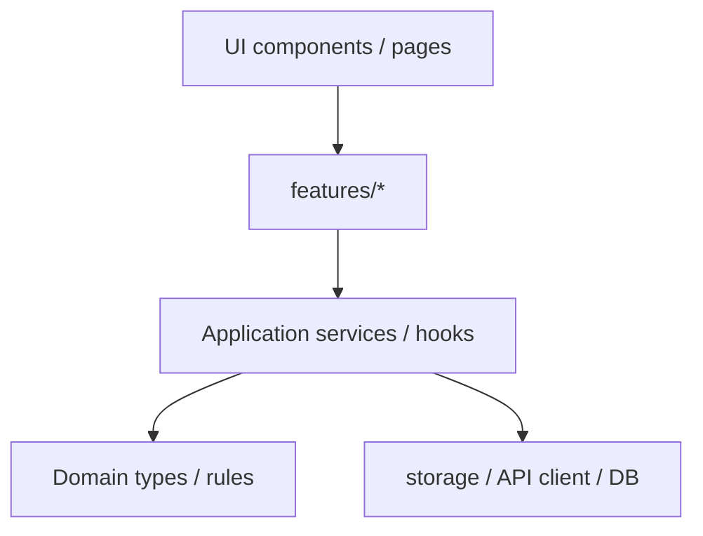

# ANIMAPS — Proposed structure (ETAPA 2)

Target shape for the monorepo, reconciled with the Architecture Charter and the staged rollout already in [architecture.md](../architecture.md). Current inventory: [current-structure.md](current-structure.md). How we get there: [migration-plan.md](migration-plan.md).

**Rule:** Prefer clear, explicit structure that solves real problems. Do not scaffold empty apps or packages until a wave needs them.

---

## 1. Principles

| Principle | Meaning |
|---|---|
| One clear place | Each domain/feature has a predictable home |
| One clear responsibility | Split files when responsibilities diverge, not only when lines grow |
| Feature / domain organization | Frontend by `features/`; backend by `modules/` |
| Staged growth | Create `apps/api`, `apps/admin`, `apps/institutional`, `packages/*` when consumers exist |
| Separation | UI ≠ business rules ≠ persistence |
| Public feature APIs | Import other features only via `index.ts` |
| Dependency direction | UI → features → application services → domain → infrastructure |

---

## 2. Target monorepo tree (annotated by wave)

```text
animaps/
├── apps/
│   ├── web/                    # EXISTS — Phase 1 primary client
│   ├── api/                    # Wave 2 — NestJS modular monolith
│   ├── admin/                  # Later — platform admin / moderation
│   ├── institutional/          # Later — optional dedicated gov client
│   │                           # (today: institution UX inside apps/web)
│   └── mobile/                 # Wave 3 — Expo
│
├── packages/                   # Only when 2+ apps share contracts
│   ├── ui/                     # Optional shared primitives (not required at Wave 2 start)
│   ├── shared-types/
│   ├── validation/
│   ├── utils/
│   ├── config/
│   └── api-client/
│
├── docs/
│   ├── architecture/           # EXISTS (this folder)
│   ├── domains/                # Phase C — move domain docs here
│   ├── features/               # Phase C — product UX docs
│   ├── api/                    # Phase C — REST / contracts
│   ├── database/               # Phase C — schema artifacts
│   ├── infrastructure/         # Phase C — deploy / compose notes
│   ├── security/               # Phase C — authZ, LGPD, privacy
│   ├── decisions/              # EXISTS — ADRs
│   └── roadmap/                # Phase C — phases / kanban links
│
├── infra/                      # Wave 2+ — formalize docker/compose/db
│   ├── docker/
│   ├── compose/
│   ├── database/
│   ├── monitoring/
│   └── deployment/
│
├── tests/                      # When e2e/integration land
│   ├── e2e/
│   ├── integration/
│   └── fixtures/
│
├── scripts/
├── .github/workflows/
├── package.json
├── pnpm-workspace.yaml         # Grow to apps/* + packages/* when packages exist
├── .env.example
└── README.md
```

### Wave annotations

| Path | When to create |
|---|---|
| `apps/web` | Already exists |
| `apps/api` | First Nest module / Prisma work (Wave 2) |
| `packages/{types,validation,api-client}` | When web + api (or mobile) share DTOs |
| `apps/admin` | When platform moderation needs a dedicated app |
| `apps/institutional` | Only if government UX outgrows `apps/web` institution features; until then keep in web |
| `infra/*` | When compose/Dockerfiles outgrow root `docker-compose.yml` |
| `tests/e2e` | When Playwright (or similar) is introduced |

---

## 3. Frontend feature template

Preferred layout for a growing feature under `apps/web/src/features/<name>/`:

```text
features/<name>/
├── pages/              # Optional — page-level composition if not using app/ alone
├── components/
├── hooks/
├── services/           # Client API / local use-case adapters (Phase 1: may wrap storage)
├── schemas/            # Zod (or equivalent) when validation is non-trivial
├── types/
├── utils/
├── storage.ts          # Phase 1 only — localStorage boundary
├── store.ts            # Prefer focused stores / hooks as complexity grows
└── index.ts            # Public API only
```

Not every feature needs every folder. Create folders when content exists.

### Pages vs components

- **Pages / thin routes:** layout, composition, wiring.
- **Components:** UI pieces with clear ownership.
- **Hooks:** one primary concern each (`useCases`, `useCreateCase`, `useCaseFilters` — not one mega-hook).
- **Services / use cases:** business decisions and orchestration, not JSX.

### Complex component folders

When a screen has independent parts:

```text
CaseDetail/
├── CaseDetail.tsx
├── CaseDetailHeader.tsx
├── CaseDetailTimeline.tsx
└── CaseDetailActions.tsx
```

Avoid over-fragmentation: split on responsibility, reuse, and testability.

---

## 4. Backend module template (Wave 2)

```text
apps/api/src/
├── modules/
│   ├── auth/
│   ├── users/
│   ├── animals/
│   ├── adoption/
│   ├── reports/          # Original intake (denúncia / ocorrência)
│   ├── cases/            # Institutional process
│   ├── organizations/
│   ├── institutions/
│   ├── teams/
│   ├── roles/
│   ├── permissions/
│   └── …
├── shared/
├── config/
├── database/
├── integrations/
├── jobs/
└── server/
```

Layer flow:

```text
REQUEST → CONTROLLER → SERVICE / USE CASE → REPOSITORY → DATABASE
```

Prefer use-case folders for complex domains (`create-case/`, `assign-case/`, …) over a single giant service file.

---

## 5. Reports vs Cases (domain rule)

| Concept | Meaning |
|---|---|
| **Report** | Original intake (denúncia, found animal, risk tip, occurrence) |
| **Case** | Institutional process after validation / classification / routing |

Do not collapse intake and institutional workflow into one ambiguous model. See [ADR-005](../decisions/ADR-005-report-case-separation.md) and product docs [cases.md](../domains/cases.md), [case-routing.md](../domains/case-routing.md).

---

## 6. Docs taxonomy mapping (Phase C — **applied 2026-09-10**)

Existing flat files → taxonomy folders. Live layout matches the table below (filenames kept where possible; `api.md` / `database.md` → `*/overview.md`; profiles consolidated).

### `docs/architecture/` (partially exists)

| Current / future | Target |
|---|---|
| `architecture.md` | Keep at `docs/architecture.md` **or** move to `docs/architecture/overview.md` in Phase C (prefer symlink/redirect note) |
| `current-structure.md` | `docs/architecture/current-structure.md` |
| `proposed-structure.md` | `docs/architecture/proposed-structure.md` |
| `migration-plan.md` | `docs/architecture/migration-plan.md` |
| `conventions.md` | `docs/architecture/conventions.md` (or keep top-level if widely linked) |
| `bounded-contexts.md` | `docs/architecture/modules.md` or `docs/domains/` overview |

### `docs/domains/`

| Current | Target |
|---|---|
| `overview.md` | `docs/domains/overview.md` (or keep as ecosystem entry) |
| `account-types.md` | `docs/domains/account-types.md` |
| `user-types.md` | `docs/domains/users.md` (or keep name) |
| `profiles.md` / `profile.md` | Consolidate → `docs/domains/profiles.md` |
| `organizations.md` | `docs/domains/organizations.md` |
| `institutions.md` | `docs/domains/institutions.md` |
| `government.md` | `docs/domains/government.md` |
| `cases.md` | `docs/domains/cases.md` |
| `case-routing.md` | `docs/domains/case-routing.md` |
| `roles-and-permissions.md` | `docs/domains/permissions.md` |
| `matching.md` | `docs/domains/match.md` |

### `docs/features/`

| Current | Target |
|---|---|
| `authentication.md` | `docs/features/authentication.md` |
| `onboarding.md` | `docs/features/onboarding.md` |
| `verification.md` | `docs/features/verification.md` |
| `dashboard.md` | `docs/features/dashboard.md` |
| `institution-dashboard.md` | `docs/features/institution-dashboard.md` |
| `user-flow.md` | `docs/features/user-flow.md` |

### `docs/api/`

| Current | Target |
|---|---|
| `api.md` | `docs/api/overview.md` or `docs/api/rest.md` |

### `docs/database/`

| Current | Target |
|---|---|
| `database.md` | `docs/database/overview.md` |
| `data-dictionary.md` | `docs/database/data-dictionary.md` |
| `der.dbml` | `docs/database/der.dbml` |
| `schema.prisma` | `docs/database/schema.prisma` |
| `schema-evolution.md` | `docs/database/schema-evolution.md` |
| `data-flow.md` | `docs/database/data-flow.md` |

### `docs/security/`

| Current | Target |
|---|---|
| `security.md` | `docs/security/security.md` |
| `privacy.md` | `docs/security/privacy.md` |
| `lgpd-checklist.md` | `docs/security/lgpd-checklist.md` |
| `privacy-policy-draft.md` | `docs/security/privacy-policy-draft.md` |
| `audit.md` | `docs/security/audit.md` |
| `permissions.md` / `permissions-matrix.md` | `docs/security/` or keep under domains |

### `docs/decisions/` (exists)

| Current | Target |
|---|---|
| ADRs (this pass) | `docs/decisions/ADR-00N-*.md` |

### `docs/roadmap/` / process

| Current | Target |
|---|---|
| `roadmap.md` | `docs/roadmap/roadmap.md` |
| `git-and-ci.md` | `docs/infrastructure/git-and-ci.md` or process folder |
| `personas.md`, `pilot-ngo.md` | `docs/features/` or `docs/roadmap/` |
| Landing briefs | `docs/features/landing/` |

Phase C must update all cross-links (`docs/README.md`, root `README.md`, in-doc relative links).

---

## 7. Naming conventions

| Kind | Convention | Example |
|---|---|---|
| Folders | kebab-case | `lost-found/`, `case-routing/` |
| Non-component files | kebab-case preferred for services | `create-animal.service.ts` |
| Components | PascalCase | `AnimalCard.tsx` |
| Functions | camelCase | `getAdjacentSteps` |
| Constants | UPPER_SNAKE_CASE | `MAX_FILE_SIZE`, `ONBOARDING_DRAFT_KEY` |
| Config keys (user types) | SCREAMING_SNAKE | `PERSON`, `ONG` (see [conventions.md](./conventions.md)) |

Existing files that use `camelCase` filenames (e.g. `store.ts`, `useCases.ts`) may remain until a feature is actively refactored — avoid mass renames without benefit.

---

## 8. File-size thresholds (charter)

| Lines | Action |
|---|---|
| > 200 | Analyze cohesion |
| > 300 | Review responsibilities |
| > 500 | Justify or split |
| > 800 | Treat as architectural problem unless dictionary/schema |

Do **not** split artificially to chase line counts. Split on real responsibilities.

---

## 9. Dependency flow



Avoid:

- Circular feature imports
- Deep imports across feature internals
- Business rules inside presentational components
- Repositories / storage modules owning domain policy

---

## 10. Global `components/` policy

`apps/web/src/components/` holds **only** shared primitives and layout/feedback:

- UI: Button, Input, Modal, Select, Card, Badge, …
- Layout: shells shared across products
- Feedback: EmptyState, ErrorState, Loading, …

Feature-specific cards/forms stay inside `features/<name>/`.

---

## 11. Institutional product boundary

Institution / government UX is a **distinct product surface** ([government.md](../domains/government.md)), even while it lives under `apps/web`:

```text
features/institution/
├── overview / dashboard
├── cases inbox
├── team/
├── routing/
├── integrations/
├── map / analytics / profile
└── …
```

A separate `apps/institutional` is optional later; do not duplicate the social/match dashboard.

---

## Decision log

- Proposed structure adopts the Architecture Charter as policy while keeping Wave-gated scaffolding.
- Docs taxonomy is mapped for Phase C; files are not moved in ETAPA 2 documentation alone.
- `apps/institutional` remains optional; institution features may stay in `apps/web` until proven otherwise.
- **Phase C (2026-09-10):** Taxonomy folders created and docs moved; mapping in §6 is now the live layout (filenames kept where possible; `api.md`/`database.md` → `*/overview.md`; profiles consolidated).
