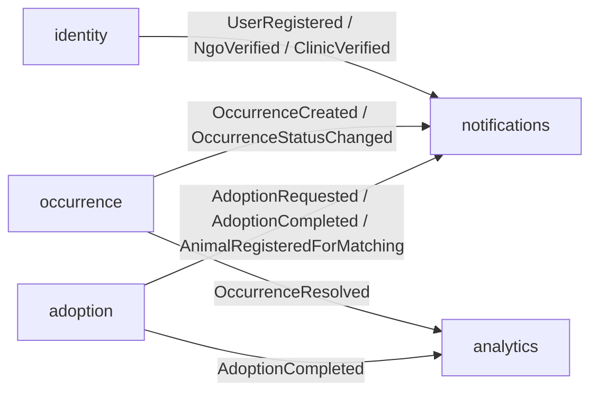

# ANIMAPS — Bounded Contexts

Documento de domínio da API NestJS (monolito modular DDD).  
Fonte de entidades: [`ANIMAPS_Roadmap.md`](../ANIMAPS_Roadmap.md) §0.5. DER: [`der.dbml`](der.dbml).

**Convenção:** identificadores de código/schema em inglês; prosa deste documento em português.

**Pastas alvo:** `apps/api/src/modules/<context>/` com `domain/`, `application/`, `infrastructure/`, `interfaces/http/`.

---

## Decisões de domínio (fechadas)

| Decisão | Detalhe |
|---|---|
| Integração entre contextos | Eventos de domínio **in-process** (pub/sub NestJS). BullMQ fica para depois (filas reais). |
| Quem cadastra `Animal` | `ngo` **verificada**, `clinic` **verificada**, ou `guardian` com `isRescuer = true` |
| Registro de `Occurrence` | Permite **anônimo** (`userId` nullable). Use case `ClaimOccurrence` vincula a uma conta depois. Rate limit por IP na infra (Fase 4). |
| Validar Occurrence | NGO verified / `public_agency`; `biologist` só para `wildlife_sighting` |
| Adoption paralelo | Várias solicitações no mesmo animal; origem escolhe; `in_process` no 1º `approved` |
| `taxId` guardian | Opcional no cadastro; obrigatório em `RequestAdoption` |

---

## Mapa dos contextos

| Contexto | Pasta | Entidades | Papel |
|---|---|---|---|
| `identity` | `modules/identity/` | `User`, `GuardianProfile`, `NgoProfile`, `ClinicProfile`, `RefreshToken`, `EmailVerificationToken`, `PasswordResetToken` | Contas, perfis, auth, verificação institucional |
| `adoption` | `modules/adoption/` | `Animal`, `Adoption` | Cadastro de animais, matching, fluxo de adoção |
| `occurrence` | `modules/occurrence/` | `Occurrence`, `OccurrenceFollower`, `OccurrenceReport` | Ocorrências geo, moderação, claim, denúncias |
| `notifications` | `modules/notifications/` | `Notification` | Preferências, disparo e histórico |
| `analytics` | `modules/analytics/` | (somente leituras/agregações no MVP) | Indicadores e exportação anonimizada |

`AuditLog` é **cross-cutting** (port compartilhado): escrito por `identity`, `occurrence` e `analytics` em ações sensíveis — não forma um bounded context próprio no MVP.

`identity` é a **fonte de verdade** de usuários e perfis. Os demais contextos referenciam `userId` / `ngoId` / `guardianId` / `clinicId` **sem** duplicar dados de perfil.

---

## Integração entre contextos (eventos in-process)



| Evento | Publicado por | Consumido por |
|---|---|---|
| `UserRegistered` | `identity` | `notifications` |
| `NgoVerified` | `identity` | `notifications` |
| `ClinicVerified` | `identity` | `notifications` |
| `AdoptionRequested` | `adoption` | `notifications` |
| `AdoptionCompleted` | `adoption` | `notifications`, `analytics` |
| `AnimalRegisteredForMatching` | `adoption` | `notifications` (pode emitir `NewCompatibleAnimalAvailable` aos guardians compatíveis — lógica de matching na Fase 3) |
| `OccurrenceCreated` | `occurrence` | `notifications` |
| `OccurrenceStatusChanged` | `occurrence` | `notifications` |
| `OccurrenceResolved` | `occurrence` | `analytics` |

`notifications` e `analytics` **só consomem** eventos no MVP — não publicam eventos de escrita de domínio.

Regra: um contexto **não** importa classes de domínio de outro. Comunicação = eventos ou leitura de IDs + ports (ex.: “este `userId` é NGO verificada?” via query/port de `identity`).

---

## 1. `identity`

### Objetivo

Gerenciar identidade, autenticação, autorização de perfil e verificação institucional.

### Linguagem ubíqua

- **User** — conta autenticável com um `role`
- **Guardian** — pessoa que adota / cuida; pode ser **rescuer** (`isRescuer`)
- **NGO** — organização; precisa estar **verified** para ações privilegiadas
- **Clinic** — clínica veterinária parceira
- **Public agency / Biologist** — papéis de validação e dados agregados

### Entidades

- `User`
- `GuardianProfile` (inclui `isRescuer: boolean`)
- `NgoProfile` (inclui `verified: boolean`)
- `ClinicProfile` (inclui `verified: boolean`)
- `RefreshToken` (hash only)
- `EmailVerificationToken` (hash only)
- `PasswordResetToken` (hash only)

### Use cases principais

| Use case | Descrição |
|---|---|
| `RegisterUser` | Cadastro com `role` e consentimento LGPD |
| `LoginUser` | Emite access + refresh token |
| `RefreshAccessToken` | Rotaciona access via refresh válido |
| `RevokeRefreshToken` / `LogoutUser` | Revoga refresh (blacklist) |
| `VerifyEmail` | Consome `EmailVerificationToken` |
| `RequestPasswordReset` / `ResetPassword` | Fluxo com `PasswordResetToken` |
| `UpdateGuardianProfile` | Preferências + flag `isRescuer` |
| `UpdateNgoProfile` / `SubmitNgoDocuments` | Dados institucionais |
| `VerifyNgo` | Aprovação manual → emite `NgoVerified` + `AuditLog` |
| `UpdateClinicProfile` | Serviços e horários |
| `SubmitClinicDocuments` / `VerifyClinic` | Aprovação manual → emite `ClinicVerified` + `AuditLog` |
| `DeleteAccount` | Exclusão / direito ao esquecimento + `AuditLog` |

### Anti-limites

- Não calcula score de compatibilidade
- Não gerencia ciclo de vida de `Animal` / `Adoption` / `Occurrence`
- Não envia e-mail diretamente (emite evento; infra/notificação despacha)

### Dependências

- **Publica:** `UserRegistered`, `NgoVerified`, `ClinicVerified`
- **Consome:** nenhum (raiz)

---

## 2. `adoption`

### Objetivo

Cadastro de animais disponíveis, algoritmo de compatibilidade e fluxo de solicitação/aprovação de adoção.

### Linguagem ubíqua

- **Animal** — indivíduo cadastrado para adoção
- **Adoption** — processo entre guardian e origem do animal
- **Compatibility score** — pontuação 0–100 no momento da solicitação
- **Rescuer** — guardian autorizado a cadastrar animal

### Entidades

- `Animal` (origem: `ngoId` e/ou `guardianId` e/ou `clinicId`)
- `Adoption`

### Quem pode criar `Animal`

| Ator | Condição |
|---|---|
| `ngo` | `NgoProfile.verified = true` |
| `clinic` | `ClinicProfile.verified = true` |
| `guardian` | `GuardianProfile.isRescuer = true` |

**Solicitações paralelas:** várias `Adoption` em `requested` / `under_review` no mesmo animal são permitidas; a origem escolhe. O animal só muda para `in_process` no primeiro `approved` (não no `requested`).

**`RequestAdoption`:** exige guardian autenticado com `taxId` preenchido.

### Use cases principais

| Use case | Descrição |
|---|---|
| `RegisterAnimal` | CRUD inicial + fotos (URLs); emite `AnimalRegisteredForMatching` |
| `UpdateAnimal` / `ArchiveAnimal` | Edição; só dono do recurso |
| `ListAvailableAnimals` | Filtros; exclui `in_process` / `adopted` das buscas novas |
| `CalculateCompatibility` | MatchingService (regras ponderadas) |
| `RequestAdoption` | Cria `Adoption` + score → `AdoptionRequested` |
| `ReviewAdoption` | Aprovar / recusar / pedir mais info |
| `CompleteAdoption` | Status final + animal `adopted` → `AdoptionCompleted` |
| `CancelAdoption` | Cancelamento por parte interessada |

### Anti-limites

- Não autentica usuários (consulta `identity` via port/guard)
- Não registra ocorrências geográficas
- Não persiste preferências de notificação

### Dependências

- **Lê:** `identity` (role, `verified`, `isRescuer`, preferências do guardian para matching)
- **Publica:** `AdoptionRequested`, `AdoptionCompleted`, `AnimalRegisteredForMatching`
- **Consome:** nenhum obrigatório no MVP

---

## 3. `occurrence`

### Objetivo

Registro e acompanhamento territorial de situações envolvendo fauna (doméstica e silvestre).

### Linguagem ubíqua

- **Occurrence** — registro georreferenciado
- **Anonymous report** — ocorrência sem `userId`
- **Claim** — vincular ocorrência anônima a um `User` autenticado
- **Validation** — selo de veracidade por NGO / public agency
- **Follower** — órgão/usuário que acompanha a ocorrência (N:N)

### Entidades

- `Occurrence` (`userId` **nullable**)
- `OccurrenceFollower` (junção N:N)
- `OccurrenceReport` (denúncia de spam/duplicidade/fraude)

### Use cases principais

| Use case | Descrição |
|---|---|
| `RegisterOccurrence` | Cria com GPS ou pin no mapa; `userId` opcional |
| `ClaimOccurrence` | Associa `userId` a ocorrência anônima (dono/claim) |
| `UpdateOccurrenceStatus` | `open` → `in_progress` → `resolved` / `invalid` |
| `ValidateOccurrence` | Define `validatedBy` — NGO verified / public_agency; biologist só se `wildlife_sighting` → `AuditLog` |
| `FollowOccurrence` | Adiciona follower (NGO verified / public_agency; biologist só wildlife) |
| `ListOccurrencesNearby` | Query espacial (`ST_DWithin`) — via infra/PostGIS |
| `ReportFalseOccurrence` | Cria `OccurrenceReport` (spam, duplicate, false_information, inappropriate_content) |

### Anti-limites

- Não faz matching de adoção
- Não agrega KPIs (deixa para `analytics`)
- Rate limiting e EXIF são preocupação de **infraestrutura**, não regra de domínio pura

### Dependências

- **Lê:** `identity` (para validar papéis de quem valida/segue)
- **Publica:** `OccurrenceCreated`, `OccurrenceStatusChanged`, `OccurrenceResolved`
- **Consome:** nenhum obrigatório no MVP

---

## 4. `notifications`

### Objetivo

Preferências, disparo e histórico de notificações in-app (e, depois, e-mail/push).

### Linguagem ubíqua

- **Notification** — mensagem endereçada a um `userId`
- **Preference** — o que o usuário aceita receber (detalhe na Fase 6; MVP pode ser mínimo)

### Entidades

- `Notification`

### Use cases principais

| Use case | Descrição |
|---|---|
| `CreateNotification` | Persistência a partir de handler de evento |
| `ListUserNotifications` | Inbox |
| `MarkNotificationRead` | Marcar lida |
| `UpdateNotificationPreferences` | (MVP enxuto / Fase 6) |

### Handlers de evento (consumidores)

- `UserRegistered` → boas-vindas / verificar e-mail
- `NgoVerified` / `ClinicVerified` → instituição liberada
- `AdoptionRequested` → notificar NGO/origem
- `AdoptionCompleted` → notificar partes
- `AnimalRegisteredForMatching` → avaliar guardians compatíveis e criar notificação `NewCompatibleAnimalAvailable` (algoritmo detalhado na Fase 3)
- `OccurrenceCreated` → notificar NGOs/órgãos na área (quando área estiver modelada)
- `OccurrenceStatusChanged` → notificar autor (se houver `userId`)

### Anti-limites

- Não altera status de adoção ou ocorrência
- Não calcula indicadores

### Dependências

- **Publica:** nenhum (MVP)
- **Consome:** eventos listados acima

---

## 5. `analytics`

### Objetivo

Indicadores agregados e exportação anonimizada para NGOs, pesquisadores e poder público.

### Linguagem ubíqua

- **KPI** — métrica agregada (adoções, ocorrências, hotspots)
- **Anonymized export** — dados sem PII / geo generalizada

### Entidades (MVP)

Sem tabela de escrita de domínio própria no MVP. Leituras via queries/materialized views sobre dados de `adoption` e `occurrence` (infra).

### Use cases principais

| Use case | Descrição |
|---|---|
| `GetAdoptionKpis` | Contagens, tempo médio, score médio |
| `GetOccurrenceKpis` | Por tipo/região/período |
| `GetRegionalHeatmapData` | Agregados para mapa de calor |
| `ExportAnonymizedDataset` | CSV/JSON sem PII → `AuditLog` (`data_exported`) |

### Anti-limites

- Não cria adoções/ocorrências
- Não envia notificações
- Nunca expõe coordenada exata + identidade juntos

### Dependências

- **Publica:** nenhum
- **Consome:** `AdoptionCompleted`, `OccurrenceResolved` (para invalidar cache / disparar recálculo; ou job periódico — detalhe na Fase 5)

---

## Dependências entre contextos (resumo)

```
identity ──(IDs / ports)──► adoption
identity ──(IDs / ports)──► occurrence
adoption ──(events)───────► notifications, analytics
occurrence ─(events)──────► notifications, analytics
identity ──(events)───────► notifications
```

Evitar dependência cíclica: `notifications` e `analytics` nunca são importados por `identity` / `adoption` / `occurrence` no domínio.

---

## Checklist de alinhamento com o código futuro

- [x] Nomenclatura em inglês (entidades, use cases, eventos)
- [x] Pastas = nomes dos contextos
- [x] `isRescuer` documentado
- [x] Occurrence anônima + `ClaimOccurrence`
- [x] Eventos in-process como padrão de integração
- [x] Tokens (refresh / email / password reset) + `AuditLog` + `OccurrenceReport`
- [x] Contrato de evento `AnimalRegisteredForMatching` → notificação de compatibilidade
