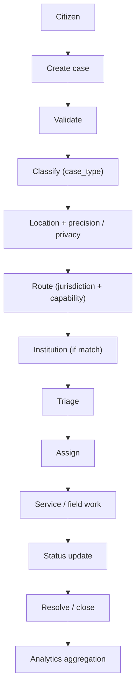
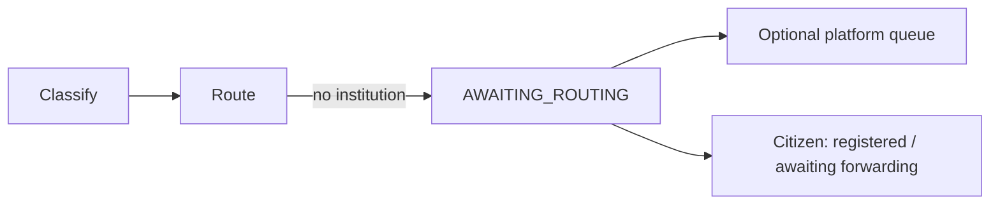
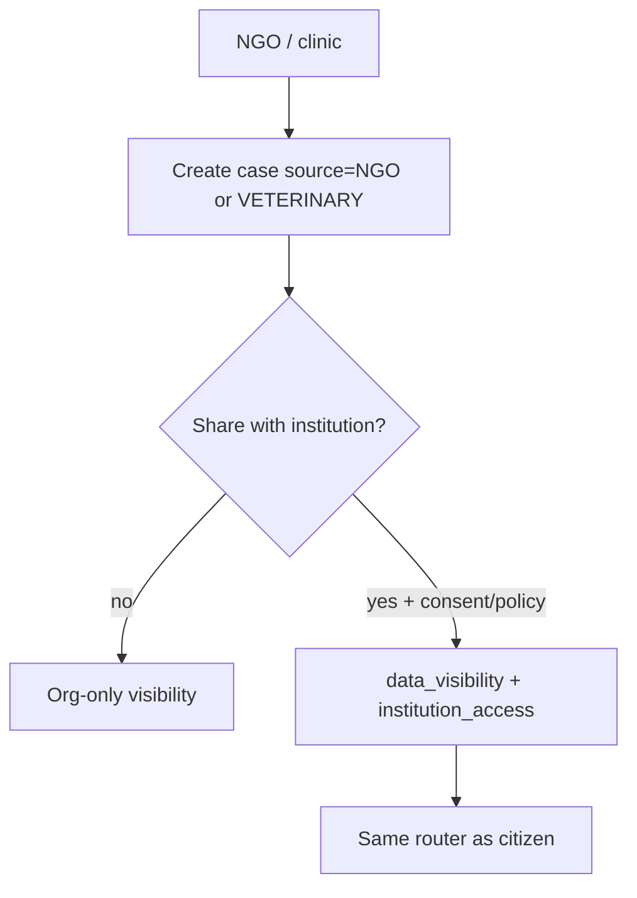

# ANIMAPS — Data flow

End-to-end path from a citizen (or org/clinic) record to institutional work and analytics. Companion to [cases.md](../domains/cases.md) and [case-routing.md](../domains/case-routing.md).

Related: [overview.md](../domains/overview.md) · [government.md](../domains/government.md) · [organizations.md](../domains/organizations.md) · [privacy.md](../security/privacy.md) · [bounded-contexts.md](../architecture/bounded-contexts.md) · [integrations.md](../features/integrations.md).

**Status:** architecture. Wave 2 occurrence events (`OccurrenceCreated`, …) stay in [bounded-contexts.md](../architecture/bounded-contexts.md). Case pipeline is additive.

---

## Happy path (citizen → close → analytics)

Linear story:

1. **Citizen** submits a case (or a Wave 2 occurrence that later opens a case).
2. **Validate** — schema, required fields, spam heuristics, optional human check. Not the same as NGO/`public_agency` occurrence “truth seal”.
3. **Classify** — `case_type` (seeded table; user pick + staff may correct).
4. **Location** — store per [privacy.md](../security/privacy.md) precision; denormalize city/state for aggregates.
5. **Route** — [case-routing.md](../domains/case-routing.md). No match → stop at institution hop; citizen sees `AWAITING_ROUTING`.
6. **Institution** — inbox only if `APPROVED` and a routing row exists.
7. **Triage** — priority, duplicate, request info, reject/invalid.
8. **Assign** — user or team; append `case_assignments`.
9. **Service** — field or desk work; internal comments.
10. **Update** — internal status + optional public update (never leak internals).
11. **Close** — `RESOLVED` / `CLOSED`; `closed_at`.
12. **Analytics** — aggregates by type/region/period; no identity + exact geo together.

In-process domain events (future `case` context) should follow the same style as adoption/occurrence: publish `CaseCreated`, `CaseRouted`, `CaseAssigned`, `CaseStatusChanged`, `CaseResolved` for [notifications](../architecture/bounded-contexts.md) / analytics — without importing other contexts’ domain classes.

---

## Branch: no routing match

Do not emit “delivered to public agency”. NGO may still work the situation locally.

---

## Branch: forwarding

After triage, institution A forwards to B with a reason ([case-routing.md](../domains/case-routing.md)). Flow resumes at B’s triage. Analytics stay attributable to the case id, not duplicated as new cases.

---

## NGO / clinic as sources

Organizations are **sources**, not automatic government pipes.

| Control | Meaning |
|---|---|
| `data_visibility` | `private` · `shared` · `institutional` (names TBD in schema) |
| `institution_access` | Which institution ids may read |
| Consent / purpose | Required for clinic **client** data — never auto-share patient records |

Clinic emergency “found stray at reception” can be a case **about the animal**, not the paying client’s medical file.

Wave 2: ONG `REPORT` and clinic `CREATE_ANIMAL` stay as in [permissions.md](../security/permissions.md) / matrix. Sharing into Case is a new, explicit action.

---

## Anonymous citizen

Anonymous create (no login) already exists for occurrences (`user_id` null). For Case:

- `reporter_id` null
- `reporter_visibility = ANONYMOUS`
- Router skips institutions with `anonymous_reports = false`
- Claim token pattern from [api.md](../api/overview.md) occurrence later-wave (`claimToken` plaintext once, hash stored) may be reused — **later wave**, not this freeze’s identity endpoints

---

## Import / API / partner

`source = IMPORT | API | PARTNER` enters after validation/classification (or mapping from external codes). Sync state lives on [integrations.md](../features/integrations.md). Failed remote ack ≠ routed.

---

## Analytics sink

`analytics` context remains read-side ([bounded-contexts.md](../architecture/bounded-contexts.md)). Case closure should eventually invalidate/recompute KPIs like `OccurrenceResolved` / `AdoptionCompleted`. Exports: neighborhood/city, [audit](../security/audit.md) `data_exported`.

---

## Current vs future

| Current | Future |
|---|---|
| Occurrence create → notify in area (when modeled) | Full case pipeline + router |
| No institution inbox | Triage → assign → close |
| Nav placeholders for reports | Citizen status + institution modules |

---

## Decision log

- Canonical citizen flow: create → validate → classify → route → institution → triage → assign → service → close → analytics.
- NGO/clinic join the same Case entity with sharing controls; no automatic client-PII leak.
- No routing match is a first-class branch, not an error hidden as “sent”.
- Case events will be additive to the in-process bus; occurrence events stay until unification.
