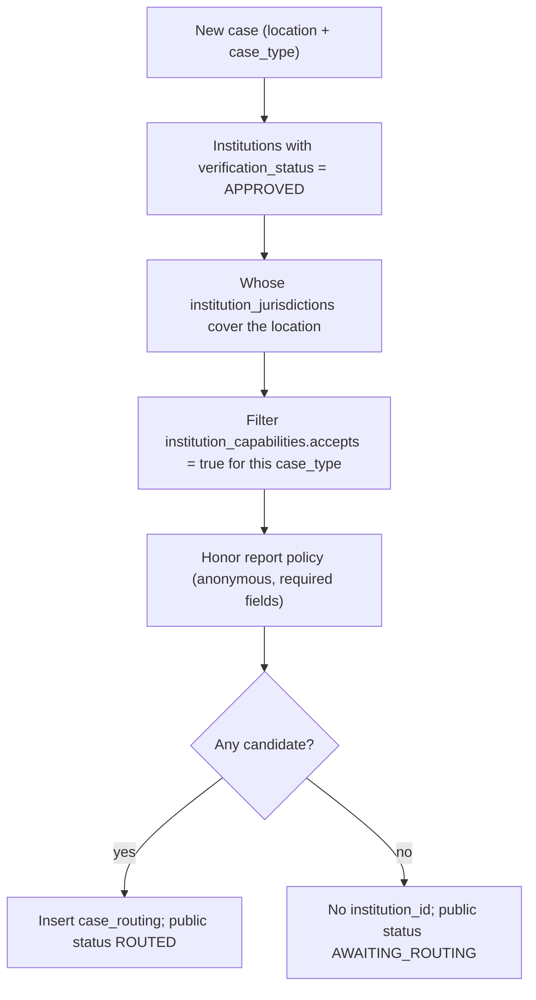
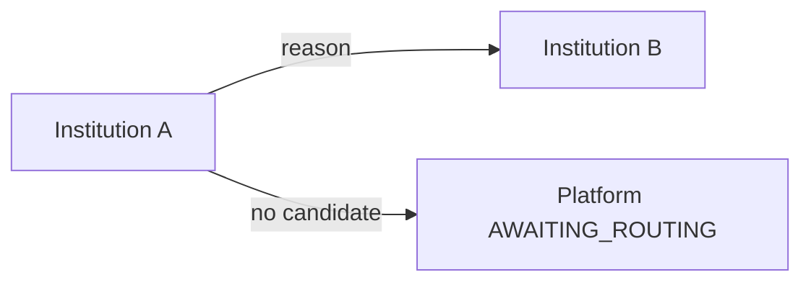

# ANIMAPS — Case routing

Routing decides **which institution (if any)** should receive a case. Inputs: location, case type, jurisdiction, capability. Output: a `case_routing` row — or **no match**.

Related: [cases.md](cases.md) · [institutions.md](institutions.md) · [government.md](government.md) · [data-flow.md](../database/data-flow.md) · [integrations.md](../features/integrations.md) · [privacy.md](../security/privacy.md).

**Status:** documented algorithm + Fase 7 web mock (`apps/web/src/features/institution/routing/`, `tryAutoRoute` / `routeCase`). Do not auto-call real government systems.

---

## Rule

```text
location + case_type + jurisdiction + capability  →  routing candidate(s)
```

If there is **no** approved institution that covers the place **and** accepts the type, the case is **not** “sent to the city”. Citizen-facing status is `AWAITING_ROUTING` ([cases.md](cases.md)). Product copy must not claim public-agency delivery.

---

## Algorithm (platform default)



| Step | Detail |
|---|---|
| 1. Eligible institutions | `verification_status = APPROVED` only (`SUSPENDED` excluded) |
| 2. Jurisdiction | Match city/state/country (later geometry / IBGE). Type `MUNICIPAL` vs `ESTADUAL` may yield multiple candidates |
| 3. Capability | Row in `institution_capabilities` with `accepts = true` for `case_type_id` |
| 4. Policy | If reporter is anonymous and `anonymous_reports = false`, skip that institution (or require identity before route — product choice, document in policy) |
| 5. Tie-break | Prefer more specific jurisdiction (`LOCAL` > `MUNICIPAL` > `ESTADUAL`); then animal-welfare department over generic city hall if both match; else leave unassigned for platform moderator — **do not** silently pick a random body |
| 6. Persist | `case_routing` + set `cases.institution_id` only when a destination is chosen |

When multiple bodies are valid, **do not** fan-out the same case to every secretariat without an explicit rule. Default: one primary destination; others may be informed as observers via `case_participants` only if policy allows.

---

## No match

| Platform | Citizen |
|---|---|
| `cases.institution_id` null | `AWAITING_ROUTING` / registered on platform |
| Queue for platform ops (optional) | Honest status: waiting for a responsible body on ANIMAPS |
| NGO/clinic may still hold a private copy | Not told that “Prefeitura X received this” |

This is the guardrail against promising public-agency delivery without a routing match.

---

## `case_routing` rows

Append-only history (forwarding adds rows; do not overwrite).

| Field | Notes |
|---|---|
| `case_id` | |
| `from_institution_id` | Null on first platform → institution hop |
| `to_institution_id` | Null if returning to platform queue |
| `reason` | See forwarding reasons |
| `routed_by_user_id` | Null if system router |
| `created_at` | |

First hop: `from_institution_id` null, `to_institution_id` set, reason `system_match` (or `other`).

---

## Forwarding between institutions

Institution A may send the case to B.

| `reason` | Meaning |
|---|---|
| `no_competence` | Not this body’s mandate |
| `out_of_region` | Outside jurisdiction |
| `out_of_type` | Does not accept this `case_type` |
| `partnership` | Agreed handoff |
| `specialization` | e.g. zoonoses vs environmental police |
| `other` | Free-text `reason_note` |



Forwarding:

1. Requires `FORWARD_CASE` (or admin) on A
2. B must be `APPROVED` and (normally) capable + in jurisdiction — operators may override with audit
3. Append routing + assignment history; update `cases.institution_id`
4. Public status may stay `ROUTED` / `RECEIVED` without exposing B’s internal queue names

Do not forward into an external protocol API unless an [integration](../features/integrations.md) is `SUCCESS` / enabled for that pair.

---

## NGO / clinic as sources

`source = NGO` | `VETERINARY` does **not** auto-route. Sharing uses `data_visibility` / `institution_access` ([data-flow.md](../database/data-flow.md)). After an explicit share, the same location+type+jurisdiction+capability matcher may run.

---

## Integrations

Routing **inside ANIMAPS** is not an integration with a government database.

| Allowed now (design) | Forbidden now |
|---|---|
| Internal `case_routing` | Calling a prefeitura SIS/API without config |
| Manual forward in UI (future) | Advertising “official filing” |
| Export/download with permission | Silent PII push to partners |

When a connection exists: `integration_connections` + logs; states `PENDING` … `DISABLED` ([integrations.md](../features/integrations.md)). Failed remote sync must **not** flip citizen status to “delivered to the agency”.

---

## Privacy

Routing metadata (institution ids, reasons) is **internal**. Citizens see coarse public status only. Location used for matching should respect stored precision (city-level case still matches `MUNICIPAL` São Paulo).

---

## Current vs future

| Current | Future |
|---|---|
| Occurrence notify “NGOs/agencies in area (when area modeled)” | This matcher + capabilities |
| No institution table | Approved institutions + jurisdictions |
| No engine | Documented algorithm, then a dedicated service |

---

## Decision log

- No match → `AWAITING_ROUTING`; never fake public-agency delivery.
- Matcher = location + type + jurisdiction + capability + approved + report policy.
- Forwarding is explicit, reasoned, append-only.
- No auto-integration with real government systems without a configured connection.
