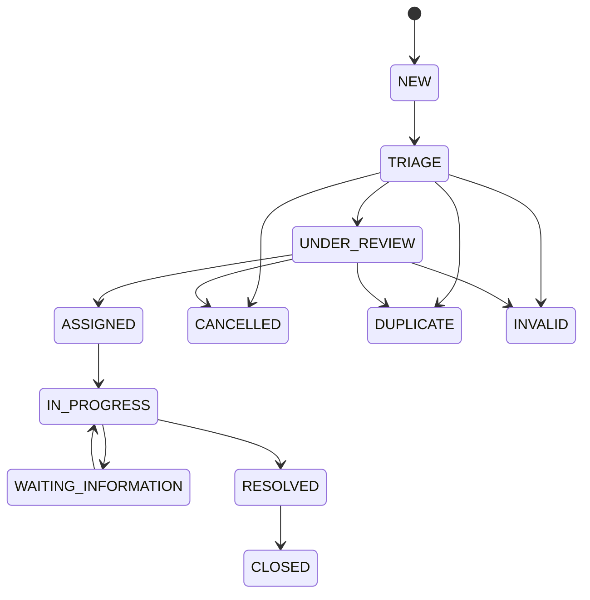

# ANIMAPS — Cases

**Case** is the central operational entity for the ecosystem layer: denunciations, occurrences-as-work-items, lost/found, help requests, risk situations, forwards, and public requests. It is **not** only a denunciation table.

Related: [overview.md](overview.md) · [case-routing.md](case-routing.md) · [government.md](government.md) · [data-flow.md](../database/data-flow.md) · [privacy.md](../security/privacy.md) · [audit.md](../security/audit.md) · [institutions.md](institutions.md) · [database.md](../database/overview.md) · [bounded-contexts.md](../architecture/bounded-contexts.md).

**Status:** Fase 3 web mock (`apps/web/src/features/cases/`) — create, claim, citizen status, comments/attachments/participants in localStorage. Nest Case API still future. Wave 2 freeze keeps `occurrences` (+ followers, reports). Optional `occurrence_id` on Case for later expand-contract.

---

## What a Case is

| Is | Is not |
|---|---|
| A work item with type, status, priority, source, location, participants | Automatically an official police/city protocol |
| Configurable taxonomy via `case_types` | A hard enum that cannot grow |
| Shared pipeline for citizen, NGO, clinic, institution | Auto-shared clinic client files |
| Paired with citizen-facing **public** status | A promise that a public agency received it |

Wave 2 `Occurrence` remains the geo report (anonymous allowed, claim, validate). Opening a Case may be triggered by an occurrence later; until then, treat them as **related domains**, not one table.

---

## `cases` (core fields)

| Field | Type | Notes |
|---|---|---|
| `id` | uuid PK | |
| `reference_number` | varchar UNIQUE | Public-friendly id (e.g. `AM-2026-000123`) |
| `case_type_id` | uuid FK | `case_types` |
| `status` | enum | **Internal** machine |
| `priority` | enum | `low` · `medium` · `high` · `critical` |
| `source` | enum | See source |
| `title` | varchar | Optional short label |
| `description` | text | |
| `location_id` | uuid FK | `case_locations` / shared locations |
| `reporter_id` | uuid FK | Nullable (anonymous account-less) |
| `organization_id` | uuid | Origin org when source is NGO/clinic |
| `institution_id` | uuid | Current responsible institution (nullable if awaiting routing) |
| `assigned_user_id` | uuid | Nullable |
| `assigned_team_id` | uuid | Nullable |
| `reporter_visibility` | enum | What the **institution** may see about the reporter |
| `data_classification` | enum | `public` · `internal` · `restricted` · `confidential` · `sensitive` |
| `occurrence_id` | uuid | Optional FK to Wave 2 `occurrences` when linked |
| `created_at` / `updated_at` / `closed_at` | timestamptz | |

Priority may be set manually now; automatic scoring is a later rules engine.

---

## `case_types` (seeded table)

**Not** a hard Postgres enum. Seed:

| Key | Rough Wave 2 occurrence overlap |
|---|---|
| `ANIMAL_ABUSE` | `mistreatment` |
| `ANIMAL_NEGLECT` | — |
| `ANIMAL_ABANDONMENT` | `abandonment` |
| `ANIMAL_AT_RISK` | — |
| `INJURED_ANIMAL` | — |
| `ROAD_ACCIDENT` | `vehicle_collision` |
| `LOST_ANIMAL` | `lost_animal` |
| `FOUND_ANIMAL` | `found_animal` |
| `STRAY_ANIMAL` | — |
| `HOARDING` | — |
| `ILLEGAL_ACTIVITY` | — |
| `ENVIRONMENTAL_RISK` | related to `wildlife_sighting` in some bodies |
| `PUBLIC_REQUEST` | — |
| `OTHER` | — |

Columns: `key`, `label_key`, `default_priority`, `is_active`, `sort_order`. Institutions accept types via `institution_capabilities` — not every type is handled the same way everywhere.

---

## Internal status machine

Also allow `CANCELLED`, `DUPLICATE`, `INVALID` from later states when policy says so (always append history).

Configurable per institution later; this is the **platform default**.

---

## Citizen-facing status vs internal status

Citizens must not see analyst names, investigation notes, or a false “sent to the city”.

**Derived** public status (not a second write source of truth — map from routing + internal status):

| Public status | When |
|---|---|
| `REGISTERED_ON_PLATFORM` | Case exists; not yet evaluated for routing |
| `AWAITING_ROUTING` | No matching institution/capability |
| `ROUTED` | `case_routing` row created toward an institution |
| `RECEIVED` | Institution acknowledged / first inbox open |
| `UNDER_ANALYSIS` | Internal `TRIAGE` / `UNDER_REVIEW` |
| `IN_PROGRESS` | Internal `ASSIGNED` / `IN_PROGRESS` / `WAITING_INFORMATION` |
| `RESOLVED` | Internal `RESOLVED` / `CLOSED` (coarse) |

If there is no routing match, public status stays `AWAITING_ROUTING` (or registered) — **never** “encaminhado a órgão público”.

Copy examples: “Registrado na plataforma” · “Aguardando encaminhamento” · “Encaminhado” · “Recebido” · “Em análise” · “Em atendimento” · “Finalizado”.

---

## Source

| `source` | Origin |
|---|---|
| `CITIZEN` | Person / anonymous report |
| `NGO` | Organization share or create |
| `VETERINARY` | Clinic/hospital share or create |
| `INSTITUTION` | Opened or forwarded by a public body |
| `SYSTEM` | Platform-generated |
| `IMPORT` | Batch import job |
| `API` | Integration connection |
| `PARTNER` | Partner feed |

---

## Reporter visibility

Independent of whether `reporter_id` is set (platform may know the user for anti-abuse).

| Value | Institution sees |
|---|---|
| `PUBLIC` | Identity as allowed by classification |
| `RESTRICTED` | Partial (e.g. city, not full name) |
| `CONFIDENTIAL` | Only roles with clearance |
| `ANONYMOUS` | No public identity; institution may still get a case |

Anonymous **intake** also requires `institution_report_policies.anonymous_reports` for that destination ([privacy.md](../security/privacy.md)). Wave 2 already allows anonymous `occurrences.user_id` null.

---

## Data classification

On the case (and inherited by attachments unless overridden): `PUBLIC` · `INTERNAL` · `RESTRICTED` · `CONFIDENTIAL` · `SENSITIVE`. Read paths check classification + role. See [privacy.md](../security/privacy.md).

---

## Locations

`case_locations` (or shared `locations` used by cases):

| Field | Notes |
|---|---|
| `latitude` / `longitude` | Stored only at the precision policy allows |
| `city` / `state` / `country` / `postal_code` | Denormalized for aggregates (same idea as occurrence city/neighborhood) |
| `formatted_address` | Optional |
| `precision` | `EXACT` · `APPROXIMATE` · `CITY` · `REGION` · `HIDDEN` |
| `privacy_level` | Align with classification / map rules |

Wave 2: `user_locations` round to ~100 m; occurrences keep precise PostGIS **and** city/neighborhood for aggregates ([database.md](../database/overview.md)). Case maps must not show exact reporter home when precision is not `EXACT` or the viewer lacks clearance. Public heatmaps use grid / cluster / city.

---

## Comments

| Channel | Audience | Example |
|---|---|---|
| Internal | Institution members with permission | “Equipe enviada para verificar.” |
| Public | Reporter / citizen status page | “Seu registro está em análise.” |

**Never** mix. `case_comments.visibility` is `internal` \| `public`. Official citizen updates may also use `CREATE_OFFICIAL_RESPONSE`.

---

## Attachments

`case_attachments`: object-storage URLs, kind (`photo` · `video` · `document`), optional classification override. Private by default; short-lived URLs. Strip EXIF on upload when media pipeline exists (Phase 4 checklist). Do not expose verification-quality identity docs as public case photos.

---

## Participants

`case_participants`: `reporter` · `assignee` · `observer` · `routed_institution` · `origin_organization` · `responder`. Generalizes “followers” for the case workspace. Wave 2 `occurrence_followers` stays until unification.

---

## History and assignments

- `case_status_history` — append-only: who, when, from_status, to_status, note
- `case_assignments` — append-only: unassigned / user / team / transfer
- `case_routing` — see [case-routing.md](case-routing.md)

These feed the timeline UI (“10:30 created · 10:35 routed · 11:20 assigned”). Cross-cutting [audit_logs](../security/audit.md) still records sensitive actions.

---

## Notifications (prepared)

Events (future `notifications` types): new case, assigned, updated, information requested, forwarded, priority, SLA near limit, new comment, new public response. Do not expand Wave 2 `notification_type` enum in the freeze until persist wave; list here as intended additions.

---

## Current vs future

| Current | Future |
|---|---|
| Mock Case UI + localStorage (`/cases`, `/cases/new`, `/cases/[id]`, `/cases/claim`) | Nest Case module + Postgres |
| Citizen status never `routed` without a routing row | Routing engine (Fase 7) |
| Institution soft-gated mock inbox | Full workspace (Fase 4) |
| `occurrences` geo + validate (map MVP) | Optional `occurrence_id` link / unify |
| Nav `/reports` → `/cases` | Stable Cases module |

---

## Decision log

- Case is additive and broader than denunciation; Wave 2 `occurrences` remain.
- Internal vs citizen status are separate vocabularies; no fake public-agency delivery.
- `case_types` is a seeded table, not a frozen enum.
- Comments split internal/public; locations carry precision + privacy.
- Status history and assignments are append-only for timeline and audit.
- Fase 3 ships citizen create/claim/status mocks before Nest persistence.
