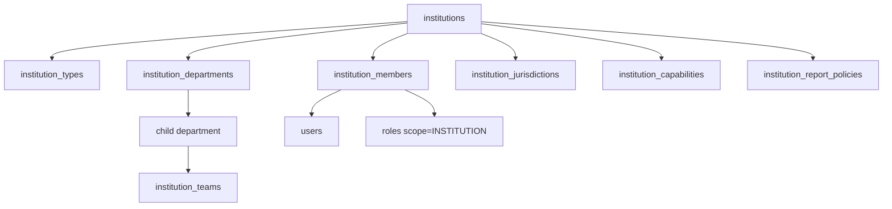
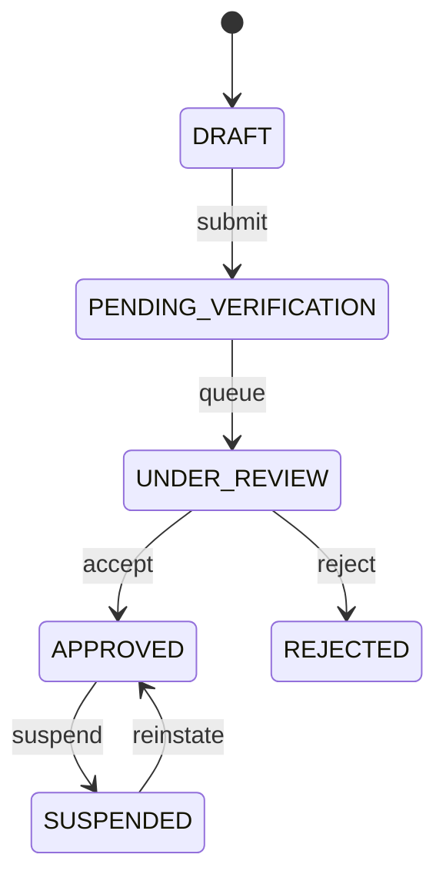

# ANIMAPS — Institutions

Public-sector bodies (layer 3): city halls, secretariats, zoonoses centers, environmental agencies, inspection, public partners. Distinct from [organizations.md](organizations.md). Privileged tools require verification — choosing “public institution” at signup is not enough.

Related: [overview.md](overview.md) · [account-types.md](account-types.md) · [government.md](government.md) · [roles-and-permissions.md](roles-and-permissions.md) · [case-routing.md](case-routing.md) · [verification.md](../features/verification.md) · [privacy.md](../security/privacy.md).

**Status:** data model + state machine (docs) + Fase 6 web mock for departments/teams/members (`apps/web/src/features/institution/team/`). No public INSTITUTION signup in Wave 2; `public_agency` remains admin-assigned ([user-types.md](user-types.md)).

---

## Entity graph

```text
institutions
  ├─ institution_types          (lookup, not a hard enum)
  ├─ institution_departments    (self-ref parent)
  ├─ institution_teams
  ├─ institution_members        (user_id + role_id)
  ├─ institution_jurisdictions
  ├─ institution_capabilities   (accepted case types)
  └─ institution_report_policies
```



Example: Prefeitura → Secretaria de Meio Ambiente → Departamento de Bem-Estar Animal → Equipe de Atendimento → João (`ANALYST`).

---

## `institutions`

| Field | Type | Notes |
|---|---|---|
| `id` | uuid PK | |
| `institution_type_id` | uuid FK | Lookup |
| `type_other` | varchar | When type key is `OTHER` |
| `official_name` | varchar | Legal / gazette name |
| `public_name` | varchar | Citizen-facing name |
| `description` | text | |
| `city` / `state` / `country` | varchar | Seat |
| `address` | text | When applicable |
| `institutional_email` | varchar | **PII** · org mailbox, not a shared login |
| `email_domain` | varchar | Optional; used as a verification hint |
| `phone` / `website` | varchar | |
| `social_links` | jsonb | Official channels only |
| `area_of_operation` | text | Free text + jurisdictions table |
| `responsible_department_name` | varchar | Collected at registration |
| `data_steward_area` | varchar | Area responsible for data |
| `verification_status` | enum | See state machine |
| `verified_at` | timestamptz | Set on `APPROVED` |
| `created_by_user_id` | uuid | Responsible person’s login |
| `created_at` / `updated_at` | timestamptz | |

No institution **case inbox, map, export, or official response** unlocks before `verification_status = APPROVED`. Suspended institutions lose those capabilities immediately.

Wave 2 `PUBLIC_AGENCY` has **no** extra profile table ([database.md](../database/overview.md)). This `institutions` row is the additive home for public-body metadata.

---

## `institution_types` (lookup)

Not a Postgres enum. Seed keys:

`CITY_HALL` · `MUNICIPAL_DEPARTMENT` · `ANIMAL_WELFARE_DEPARTMENT` · `ENVIRONMENTAL_DEPARTMENT` · `HEALTH_DEPARTMENT` · `ZOONOSES_CENTER` · `ENVIRONMENTAL_AGENCY` · `PUBLIC_INSPECTION` · `PUBLIC_PARTNER` · `OTHER`

| Column | Notes |
|---|---|
| `id` | uuid |
| `key` | UNIQUE, stable (`CITY_HALL`, …) |
| `label_key` | i18n key |
| `is_active` | Soft-hide without deleting |
| `sort_order` | |

Operators can insert rows later without a schema migration.

---

## Departments and teams

### `institution_departments`

| Field | Notes |
|---|---|
| `institution_id` | Owner |
| `parent_department_id` | Self-FK, nullable (secretariat → department) |
| `name` | |
| `code` | Optional internal code |

### `institution_teams`

| Field | Notes |
|---|---|
| `institution_id` | Owner |
| `department_id` | Nullable — small bodies may skip departments |
| `name` | e.g. Triage, Field, Management |

Members may point at a team (`institution_members.team_id`) for assignment queues ([cases.md](cases.md)).

**Web mock (Fase 6):** `localStorage` key `animaps-institution-org-v1` holds departments, teams, and members. Soft-gate blocks mutations until institutional verification is approved. Case assignment appends `case_assignments` in the cases mock and never claims official routing.

---

## Members

| Field | Notes |
|---|---|
| `institution_id` / `user_id` | UNIQUE pair |
| `role_id` | Scope `INSTITUTION` |
| `department_id` / `team_id` | Optional |
| `status` | `invited` · `active` · `suspended` · `left` |
| `invited_by_user_id` / `joined_at` | |

Each person uses their **own** login ([security.md](../security/security.md)). Seed roles: `INSTITUTION_ADMIN`, `INSTITUTION_MANAGER`, `ANALYST`, `OPERATOR`, `INSPECTOR`, `MODERATOR`, `READ_ONLY`.

---

## Jurisdictions

`institution_jurisdictions` is a **table** (one institution, many areas).

| Field | Values / notes |
|---|---|
| `jurisdiction_type` | `NATIONAL` · `ESTADUAL` · `MUNICIPAL` · `REGIONAL` · `LOCAL` |
| `country` / `state` / `city` | IBGE codes later; strings acceptable at first |
| `label` | Display (“São Paulo”) |
| `geometry` | Optional PostGIS later; routing may start with city/state match |

Routing reads this table ([case-routing.md](case-routing.md)). Example: Prefeitura de São Paulo · `MUNICIPAL` · São Paulo.

---

## Capabilities

`institution_capabilities`: which `case_types` this body **accepts**.

| Field | Notes |
|---|---|
| `institution_id` | |
| `case_type_id` | FK → `case_types` |
| `accepts` | boolean |
| UNIQUE | (`institution_id`, `case_type_id`) |

No capability row (or `accepts = false`) → institution is not a routing candidate for that type.

---

## `institution_report_policies`

Do not assume every public body accepts anonymous reports or the same fields.

| Field | Notes |
|---|---|
| `institution_id` | 1:1 |
| `anonymous_reports` | boolean |
| `required_fields` | jsonb catalog of field keys |
| `accepted_case_types` | jsonb or rely on capabilities table (prefer capabilities as source of truth) |
| `routing_rules` | jsonb / later dedicated rules |
| `response_visibility` | What citizens may see by default |
| `sla_triage_hours` / `sla_resolution_hours` | Nullable; SLA is per institution ([government.md](government.md)) |

Anonymous reports are a **policy**, not a global platform default ([privacy.md](../security/privacy.md)).

---

## Verification state machine



| Status | Meaning | Capabilities |
|---|---|---|
| `DRAFT` | Incomplete registration | Edit own draft only |
| `PENDING_VERIFICATION` | Submitted | Waiting |
| `UNDER_REVIEW` | Human / platform review | Waiting |
| `APPROVED` | Trusted public body | Inbox, routing target, official responses |
| `REJECTED` | Failed review | No privileged tools; may resubmit as new draft per policy |
| `SUSPENDED` | Was approved; paused | No new routing; existing cases stay readable per policy |

`REJECTED` does not automatically become `DRAFT` in the diagram; product may allow a new submission. `APPROVED` ↔ `SUSPENDED` only (no skip from DRAFT to APPROVED in the happy path).

Reuse `verification_requests` (`kind = institutional`) for **documents**. Institution `verification_status` is the **entity** machine; do not overload selfie statuses (`pending` / `processing` / …) onto public bodies.

Status changes write [audit.md](../security/audit.md).

---

## Fields collected at registration

Collect at institutional onboarding (future UI; not Wave 2 ONG/clinic forms):

| Group | Fields |
|---|---|
| Identity | Official name, public name, institution type (lookup), description |
| Place | City, state, country, area of operation, jurisdiction (type + label), address when applicable |
| Contact | Institutional email, phone, website, official social links |
| Structure | Responsible department, data-steward area |
| Trust | Responsible person’s existing user account, optional email domain |

CNPJ / public registry ids may be added later; do not contradict Wave 2 “no extra profile table” for `public_agency` until this table exists in Prisma.

---

## Current vs future

| Current | Future |
|---|---|
| `user_type = public_agency`, no profile table | `institutions` + members + lookup type |
| Occurrence validate if `public_agency` | Permission on membership role |
| No departments / teams | Nested departments + teams |
| Boolean mental model | Full verification machine |

---

## Decision log

- Institution types are a lookup table, not a hard enum.
- Departments self-reference; teams may skip a department.
- Jurisdictions, capabilities, and report policies are tables so routing and anonymity are per body.
- Verification: `DRAFT → PENDING_VERIFICATION → UNDER_REVIEW → APPROVED | REJECTED`, plus `APPROVED ↔ SUSPENDED`.
- Wave 2 `public_agency` mapping is additive; no privileged unlock before `APPROVED`.
