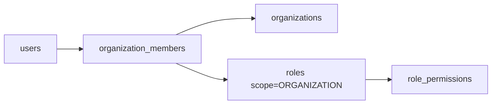

# ANIMAPS — Organizations

Civil-society and private entities in layer 2: NGOs, shelters, clinics, hospitals, businesses, services, private institutions. An organization is a **first-class row**, not only a 1:1 blob on `users`.

Related: [overview.md](overview.md) · [account-types.md](account-types.md) · [profiles.md](profiles.md) · [roles-and-permissions.md](roles-and-permissions.md) · [verification.md](../features/verification.md) · [database.md](../database/overview.md) · [institutions.md](institutions.md).

**Status:** additive tables (docs schema). Wave 2 `organization_profiles` / `veterinary_profiles` stay 1:1 on `users.id` and are **not moved** in this pass.

---

## Why a table (not only a user type)

Wave 2 models ONG and clinic as **the user**. That works for a single operator. The ecosystem needs:

- Several people in the same NGO or clinic, each with their own login
- Roles (`ORGANIZATION_ADMIN` vs `ORGANIZATION_MEMBER`)
- Subtypes beyond ONG vs clinic
- A stable `organization_id` for animals, cases (`source = NGO` / `VETERINARY`), and sharing controls

Public institutions are **not** organizations — they use [institutions.md](institutions.md).

---

## `organizations`

| Field (proposed) | Type | Notes |
|---|---|---|
| `id` | uuid PK | Stable org id |
| `organization_type` | enum / catalog | See subtypes |
| `official_name` | varchar | Legal name when known |
| `trade_name` | varchar | Public name |
| `description` | text | |
| `email` / `phone` / `website` | varchar | Org contact (distinct from login email) |
| `social_links` | jsonb | Same shape as Wave 2 `{ instagram, facebook, other }` |
| `city` / `state` / `country` | varchar | |
| `company_tax_id` | varchar | **PII** · nullable until verification (same freeze as profiles) |
| `verified` | boolean | Privilege gate — **only** admin/platform after approval |
| `created_by_user_id` | uuid | Founder login |
| `created_at` / `updated_at` | timestamptz | |

`company_tax_id` is **nullable** on first persist; **required** by application before `verified = true` — same closed Wave 2 decision as `organization_profiles` / `veterinary_profiles`.

---

## `organization_type`

| Value | Use |
|---|---|
| `ngo` | Animal protection NGO |
| `animal_shelter` | Abrigo / canil / gatil |
| `veterinary_clinic` | Clínica |
| `veterinary_hospital` | Hospital veterinário |
| `animal_business` | Empresa parceira |
| `animal_service` | Serviço (banho, adestramento, transporte, …) |
| `private_institution` | Instituto / fundação privada |
| `other` | Catch-all |

Product-stable; prefer enum + additive values ([schema-evolution.md](../database/schema-evolution.md)). Not the institution lookup table.

---

## `organization_members`

| Field | Type | Notes |
|---|---|---|
| `id` | uuid PK | |
| `organization_id` | uuid FK | |
| `user_id` | uuid FK | Individual login |
| `role_id` | uuid FK → `roles` | Scope must be `ORGANIZATION` |
| `department_label` | varchar | Optional free text until org departments exist |
| `status` | enum | `invited` · `active` · `suspended` · `left` |
| `invited_by_user_id` | uuid | |
| `joined_at` | timestamptz | |
| UNIQUE | (`organization_id`, `user_id`) | One membership row per pair |

Roles in this scope: `ORGANIZATION_ADMIN`, `ORGANIZATION_MEMBER`, `READ_ONLY` (org-scoped row). See [roles-and-permissions.md](roles-and-permissions.md).

---

## Relationship to Wave 2 profiles (not moved yet)

| Wave 2 table | FK today | Ecosystem target (later) | This pass |
|---|---|---|---|
| `organization_profiles` | `user_id` → `users.id` | Re-parent to `organizations.id` (NGO-shaped fields) | **Unchanged** |
| `veterinary_profiles` | `user_id` → `users.id` | Re-parent to `organizations.id` (clinic-shaped fields) | **Unchanged** |
| `animals.organization_id` | Origin ONG user | Origin **organization** row | Keep meaning as today until expand-contract |

Until re-parent:

1. Treat the ONG/clinic **user** as the implicit organization (1:1).
2. When `organizations` is created, dual-write: founder membership + copy of trade name / verified flag.
3. Do not delete profile columns. Expand-contract is documented in [schema-evolution.md](../database/schema-evolution.md) when that file is updated.

`verified` on profiles remains the Wave 2 privilege gate for `CreateAnimal` ([permissions-matrix.md](../security/permissions-matrix.md)). `organizations.verified` mirrors it once rows exist; do not invent a second unlock path that bypasses institutional verification.

---

## Verification

| Path | Wave 2 | Organization table |
|---|---|---|
| Documents | `verification_requests` `kind = institutional` | Same pipeline; do not split tables |
| Privilege flag | `organization_profiles.verified` / `veterinary_profiles.verified` | Copy onto `organizations.verified` when dual-writing |
| Who sets `verified` | Admin / operator after approval — **never** the client | Same |

Soft gate: users may reach dashboard with non-approved status. Privileged actions stay server-side ([verification.md](../features/verification.md)).

Organizations do **not** use the full institution state machine (`DRAFT` → … → `SUSPENDED`). That machine is for public bodies ([institutions.md](institutions.md)). Org/clinic keep boolean `verified` unless a later product decision unifies them.

---

## Data sharing into cases

An organization may create or share a [Case](cases.md) with `source = NGO` or `VETERINARY`. Sharing is **opt-in** (`data_visibility` / `institution_access`). Clinics must not auto-share private client records ([data-flow.md](../database/data-flow.md) · [privacy.md](../security/privacy.md)).

---

## Dashboard

ONG / clinic continue to use existing `DASHBOARD_CONFIGS` ([dashboard.md](../features/dashboard.md)). Organization dashboard evolution (animals, adoptions, volunteers, donations placeholders, reports) stays that shell. Government modules are out of scope here ([institution-dashboard.md](../features/institution-dashboard.md)).

---

## Current vs future

| Current | Future |
|---|---|
| One user = one ONG or clinic | Many members per `organizations` row |
| Fields on profile tables | Profile tables as type-specific extensions of `organizations` |
| `verified` boolean on profile | Same gate; org row mirrors flag |
| No membership invites | `organization_members` + org-scoped RBAC |

---

## Decision log

- New `organizations` / `organization_members` are additive; Wave 2 profile tables are not moved in this pass.
- `verified` remains an admin-set boolean for orgs/clinics (not the public-institution state machine).
- `company_tax_id` nullable until verification — Wave 2 freeze.
- Org-scoped roles only; platform admins use `user_platform_roles`.
- Private institutions (`PRIVATE_INSTITUTION`) are organizations, not `INSTITUTION` account type.
