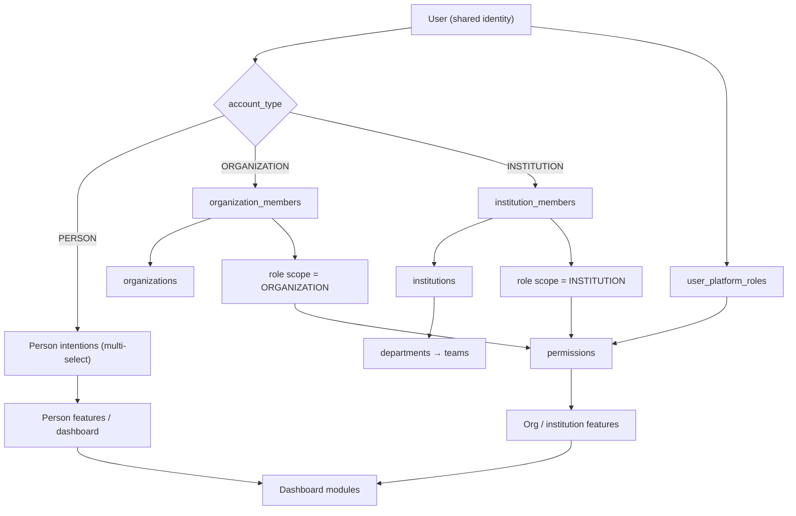

# ANIMAPS — Ecosystem overview

ANIMAPS is a **digital ecosystem of the animal universe**, not an adoption-only app. Adoption, matching, and discover remain first-class PERSON / ORGANIZATION surfaces. They sit beside organizations, public institutions, cases, routing, and a distinct government workspace.

This document is the entry point for the **additive ecosystem layer**. Wave 2 identity, waitlist, onboarding persist, and REST freeze stay in [database.md](../database/overview.md) and [api.md](../api/overview.md). Nothing here replaces `users.user_type`, 1:1 profile tables, or `occurrences`.

Related: [architecture.md](../architecture.md) · [account-types.md](account-types.md) · [organizations.md](organizations.md) · [institutions.md](institutions.md) · [government.md](government.md) · [cases.md](cases.md) · [roles-and-permissions.md](roles-and-permissions.md) · [roadmap.md](../roadmap/roadmap.md) · [user-types.md](user-types.md).

**Status:** architecture and docs. Institution screens, routing engine, and government integrations are **not** built. See [institution-dashboard.md](../features/institution-dashboard.md) (proposal) and [integrations.md](../features/integrations.md).

---

## Product thesis

The platform connects people and organizations that already exist around animals:

| Layer | Who | Examples |
|---|---|---|
| **1 — Users** | People with a personal login | Tutors, adopters, pet owners, volunteers, reporters, people looking for a lost animal, people who found an animal, community members |
| **2 — Organizations** | Private / civil-society entities | NGOs, shelters, independent protectors (as org when they operate as a group), veterinary clinics and hospitals, partner businesses, animal professionals, private institutions |
| **3 — Public institutions** | Government and public partners | City halls, municipal secretariats, animal-welfare departments, zoonoses centers, environmental agencies, inspection bodies, public partners |

Layer 3 **must not** reuse the social / match dashboard. The government environment is a separate institutional workspace ([government.md](government.md)).

---

## Layered architecture

One identity stack. Capabilities are not a second auth system; they compose:

```text
User (login)
  → AccountType (PERSON | ORGANIZATION | INSTITUTION)
    → Organization / Institution membership (optional, many)
      → Role (scoped: PLATFORM | ORGANIZATION | INSTITUTION)
        → Permissions (configurable rows)
          → Features
            → Dashboard
```



A person keeps **one login** and may hold many organization and institution memberships, each with its own role. João can be a PERSON (adopter) and an ANALYST on Prefeitura X / Departamento de Bem-Estar Animal at the same time. See [account-types.md](account-types.md).

---

## What already exists (Wave 2 — frozen)

Do not rewrite these contracts in this layer:

| Concern | Canonical doc | Stays |
|---|---|---|
| Waitlist vs register | [database.md](../database/overview.md) · [api.md](../api/overview.md) | Lead-only waitlist; Wave 2 `RegisterUser` creates `users` + hash |
| `user_type` discriminator | [user-types.md](user-types.md) | Public signup: PERSON / ONG / VETERINARY_CLINIC / OTHER; admin: PUBLIC_AGENCY / BIOLOGIST |
| 1:1 profiles | [profiles.md](profiles.md) | `person_profiles`, `organization_profiles`, `veterinary_profiles`, `other_profiles` |
| Session | [api.md](../api/overview.md) · [architecture.md](../architecture.md) | Access JWT in memory; web refresh httpOnly cookie |
| Occurrences | [database.md](../database/overview.md) · [bounded-contexts.md](../architecture/bounded-contexts.md) | Geo reports, claim, validate — **not** deleted by Case |
| UI permissions | [permissions.md](../security/permissions.md) | Coarse `hasPermission` catalog until session flags exist |
| Messages / donations / reviews / volunteers | [database.md](../database/overview.md) | Out of Wave 2 schema; nav placeholders only |

The ecosystem layer **adds** `account_type` (nullable, derived), organization/institution tables, RBAC, Case, routing, and a proposed institution dashboard **next to** that freeze.

---

## How the three layers show up in product

| Account type | Home experience today | Ecosystem target |
|---|---|---|
| PERSON | Discover + PERSON nav ([dashboard.md](../features/dashboard.md)) | Same social/match surfaces + “my cases” when Case ships |
| ORGANIZATION (today: ONG / clinic via `user_type`) | Operational `DynamicDashboard` | Same shells; later keyed by org membership + org subtype |
| INSTITUTION | No public signup; `PUBLIC_AGENCY` is admin-assigned | Dedicated government workspace — **no** match cards |

Onboarding remains one register/login path ([conventions.md](../architecture/conventions.md)). Account type only selects post-verify data collection and which dashboard modules render.

---

## Cases, not only denunciations

The operational spine of layers 2–3 is **Case** ([cases.md](cases.md)): abuse, neglect, abandonment, lost/found, stray, public request, and other types from a **seeded** `case_types` table. A case is not always a denunciation.

Routing ([case-routing.md](case-routing.md)) uses location + type + jurisdiction + capability. **No match → citizen-facing `AWAITING_ROUTING`.** Never tell the citizen a report was delivered to a public agency unless a routing row exists.

Wave 2 `occurrences` remain the geo-report entity in the freeze. Case is the institutional workflow entity. A later expand-contract may link or unify them; this pass does not drop `occurrences` or the later-wave occurrence API listed in [api.md](../api/overview.md).

---

## Principles

| Do | Do not |
|---|---|
| One identity, many memberships | Shared institutional logins |
| Configurable roles/permissions | Hardcode every feature on `user_type` forever |
| Privacy by default ([privacy.md](../security/privacy.md)) | Expose exact reporter location or internal comments |
| Verification before privileged institution actions | Unlock government tools because the user picked “public institution” |
| Prepare integrations ([integrations.md](../features/integrations.md)) | Implement a specific city/state government API now |
| Audit sensitive actions ([audit.md](../security/audit.md)) | Log passwords, tokens, or full PII |

---

## Documentation map

| Topic | Doc |
|---|---|
| Account types + legacy `UserType` mapping | [account-types.md](account-types.md) |
| Organizations, members, `verified` | [organizations.md](organizations.md) |
| Institutions, departments, verification machine | [institutions.md](institutions.md) |
| Government environment | [government.md](government.md) |
| RBAC seed + catalogs | [roles-and-permissions.md](roles-and-permissions.md) |
| Case entity | [cases.md](cases.md) |
| Routing | [case-routing.md](case-routing.md) |
| Institution dashboard (proposal) | [institution-dashboard.md](../features/institution-dashboard.md) |
| End-to-end flow | [data-flow.md](../database/data-flow.md) |
| Classification / LGPD posture | [privacy.md](../security/privacy.md) |
| AuthZ, gates, rate limits | [security.md](../security/security.md) |
| Future API / webhooks | [integrations.md](../features/integrations.md) |
| Audit reuse | [audit.md](../security/audit.md) |
| Infra + product phases | [architecture.md](../architecture.md) · [roadmap.md](../roadmap/roadmap.md) |

---

## Current vs future

| Current | Future (ecosystem layer) |
|---|---|
| `user_type` drives onboarding, nav, UI permissions | `account_type` + membership role; `user_type` remains until cutover |
| ONG / clinic = 1:1 profile on `users` | `organizations` + members; profiles not moved yet ([organizations.md](organizations.md)) |
| `PUBLIC_AGENCY` / `BIOLOGIST` admin enum values | Mapped to INSTITUTION / PERSON+professional — enum values **kept** |
| `occurrences` geo pipeline | Case + routing **additive**; occurrence routes stay in later API waves |
| Dashboard shells by `UserType` | Institution modules proposed; PERSON/ONG/clinic shells unchanged |

---

## Decision log

- Ecosystem docs are **additive**. Wave 2 freeze (`user_type`, profiles, waitlist, session, occurrences, later-wave occurrence API) is not rewritten here.
- Three layers (users / organizations / public institutions) share one identity stack; government UX is a different dashboard, not a second product.
- Case is the central operational entity for institutional workflow; it does not delete Wave 2 `occurrences` in this pass.
- Never promise public-agency delivery without a routing match ([case-routing.md](case-routing.md)).
