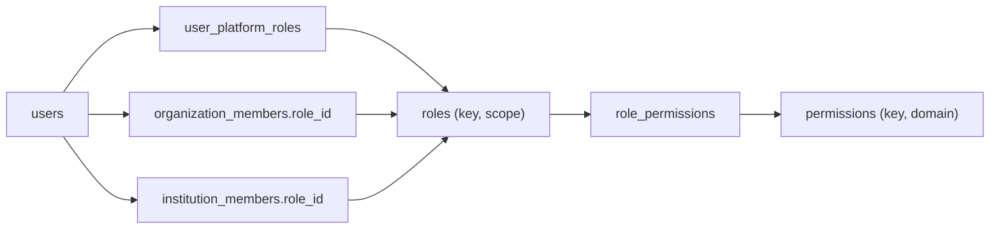

# ANIMAPS — Roles and permissions (RBAC)

Configurable **RBAC** for the ecosystem layer: roles have a **scope**, permissions are **rows**, memberships carry `role_id`. This sits beside — not instead of — the Wave 2 UI catalog and domain matrix.

Related: [overview.md](overview.md) · [account-types.md](account-types.md) · [permissions.md](../security/permissions.md) · [permissions-matrix.md](../security/permissions-matrix.md) · [organizations.md](organizations.md) · [institutions.md](institutions.md) · [security.md](../security/security.md) · [conventions.md](../architecture/conventions.md).

**Status:** seed model (docs + future `features/rbac`). Existing `PERMISSIONS_BY_USER_TYPE` / `hasPermission` stay the PERSON/ONG/clinic **UI** gate until session flags exist.

---

## Split of concerns

| Layer | Doc / code | Audience |
|---|---|---|
| UI visibility | [permissions.md](../security/permissions.md) · `features/permissions` | Hide nav / buttons |
| Domain actions (Wave 2) | [permissions-matrix.md](../security/permissions-matrix.md) | Nest guards: `user_type` + `verified` + `isRescuer` |
| Configurable RBAC | This doc · `roles` / `permissions` / `role_permissions` | Org/institution/platform memberships |

UI `hasPermission` is **never** authorization once the API exists ([conventions.md](../architecture/conventions.md)).

---

## Model

| Table | Role |
|---|---|
| `roles` | `key`, `scope` (`PLATFORM` \| `ORGANIZATION` \| `INSTITUTION`), `label_key` |
| `permissions` | `key`, `domain` (e.g. `case`, `org`, `identity`) |
| `role_permissions` | Configurable join |
| `user_platform_roles` | Platform-scoped grants (`SUPER_ADMIN`, `PLATFORM_ADMIN`) |
| Membership `role_id` | Org/institution context |

A user’s effective permissions = platform roles ∪ **active** membership role in the current org/institution context. Changing a membership role does not affect other memberships.

Do not hardcode `if (account_type === INSTITUTION)` in guards later — check permission keys.

`READ_ONLY` is **two seed rows** (org scope and institution scope); permissions differ.

---

## Seed roles

| Key | Scope | Intent |
|---|---|---|
| `SUPER_ADMIN` | `PLATFORM` | Break-glass; all platform admin + support |
| `PLATFORM_ADMIN` | `PLATFORM` | Operate ANIMAPS: verify institutions/orgs, moderate globally |
| `INSTITUTION_ADMIN` | `INSTITUTION` | Own the public body: members, policy, jurisdiction, settings |
| `INSTITUTION_MANAGER` | `INSTITUTION` | Operations lead: queues, assignment, SLA, teams |
| `ANALYST` | `INSTITUTION` | Triage, update cases, analytics (no full settings) |
| `OPERATOR` | `INSTITUTION` | Day-to-day case handling / field updates |
| `INSPECTOR` | `INSTITUTION` | Field / inspection actions; case updates in scope |
| `MODERATOR` | `INSTITUTION` | Content/quality: invalid, duplicate, abuse of the channel |
| `ORGANIZATION_ADMIN` | `ORGANIZATION` | Own the NGO/clinic: members, profile, animals policy |
| `ORGANIZATION_MEMBER` | `ORGANIZATION` | Staff: animals, requests, shared reports per org perms |
| `PERSON` | n/a (seed role key) | Default individual; UI catalog until session flags |
| `READ_ONLY` | `ORGANIZATION` and `INSTITUTION` | View-only in that scope |

`PERSON` as a role key documents the individual baseline. Until RBAC is wired, PERSON capabilities remain `PERMISSIONS_BY_USER_TYPE.PERSON` plus documented additions below (session flags).

---

## Platform assignment

`user_platform_roles`: (`user_id`, `role_id`) where `roles.scope = PLATFORM`. Used for `SUPER_ADMIN` / `PLATFORM_ADMIN` only. Not a substitute for institution membership.

Wave 2 `VerifyOrganization` / `VerifyVeterinary` (`public_agency` cond in the matrix) should eventually require a platform or designated institution permission — document the target as `VERIFY_ORGANIZATION` / `VERIFY_INSTITUTION` without changing the freeze matrix in this file’s “current” column.

---

## Permission catalogs (plan)

Keys are `SCREAMING_SNAKE` in config. Persist as `snake_case` if stored. UI catalog keys that already exist (`VIEW_ANIMALS`, `ADOPT`, …) should stay stable.

### Person (individual)

Used with the existing UI catalog. Additions are **documented** for a later `catalog.ts` update — do not treat them as live until coded.

| Permission | Intent |
|---|---|
| `VIEW_ANIMALS` | Browse listings (exists) |
| `ADOPT` | Adoption / matches (exists) |
| `CREATE_PROFILE` | Profile editors (exists) |
| `EDIT_PROFILE` | Edit own enrichment fields |
| `MESSAGE` | Messaging placeholder (exists) |
| `FAVORITE` | `animal_favorites` when that UI ships |
| `REPORT` / `CREATE_REPORT` | Create occurrence or case (REPORT exists) |
| `VIEW_REPORT_STATUS` | Citizen-facing case/occurrence status |
| `CREATE_LOST_PET` | Lost-animal case / occurrence type |
| `CREATE_FOUND_PET` | Found-animal case / occurrence type |
| `CREATE_ANIMAL` | Not static for PERSON — `is_rescuer` session flag ([permissions.md](../security/permissions.md)) |

### Organization — NGO-shaped

Aligns with ONG UI + domain matrix; extras are future (donations still **no table** in Wave 2).

| Permission | Intent |
|---|---|
| `CREATE_ANIMAL` | Requires `verified` on API |
| `EDIT_ANIMAL` / `MANAGE_ANIMALS` | Origin animals |
| `VIEW_ADOPTION_REQUESTS` | Inbox |
| `MANAGE_VOLUNTEERS` | Placeholder until schema |
| `MANAGE_DONATIONS` | Placeholder until schema |
| `VIEW_REPORTS` | Org-visible cases/occurrences |
| `RESPOND_REPORTS` | Comment / share / forward per policy |
| `MANAGE_ORGANIZATION` | Settings, members (admin) |
| `MESSAGE` | Exists on ONG UI catalog |

### Organization — veterinary clinic

| Permission | Intent |
|---|---|
| `MANAGE_SERVICES` | Catalog (exists) |
| `MANAGE_LOCATION` | Address / hours (exists) |
| `MANAGE_PROFILE` | Institutional profile (exists) |
| `VIEW_PUBLIC_REPORTS` | Public/shared cases only |
| `RESPOND_CONTACTS` | Public contact / messages |
| `MANAGE_ORGANIZATION` | Members when multi-user |
| `CREATE_ANIMAL` | `verified` on API |
| `MESSAGE` | Exists |

Clinic **must not** receive `EXPORT_DATA` or incoming-government queues by default. No automatic client-PII share.

### Institution

| Permission | Intent |
|---|---|
| `VIEW_INCOMING_REPORTS` | Inbox for routed cases |
| `VIEW_ASSIGNED_REPORTS` | Only cases assigned to me / my team |
| `ASSIGN_REPORT` | User or team assignment |
| `UPDATE_REPORT_STATUS` | Internal status machine |
| `REQUEST_INFORMATION` | Public citizen prompt |
| `VIEW_STATISTICS` | Overview counts |
| `VIEW_MAP` | Institution map (privacy-respecting) |
| `EXPORT_DATA` | Controlled export + audit |
| `MANAGE_TEAM` | Members / teams (not full institution settings) |
| `MANAGE_INSTITUTION` | Settings, verification docs, public profile |
| `MANAGE_JURISDICTION` | Jurisdictions + capabilities |
| `VIEW_ANALYTICS` | Analytics module |
| `CREATE_OFFICIAL_RESPONSE` | Citizen-visible official update |
| `VALIDATE_CASE` | Truth seal (successor to occurrence validate for agencies) |
| `FORWARD_CASE` | Institution-to-institution routing |

---

## Seed matrix (defaults)

Configurable; this is the **seed**, not hardcoded runtime.

| Role | Representative permissions |
|---|---|
| `SUPER_ADMIN` | All permission keys |
| `PLATFORM_ADMIN` | Verify org/institution, global moderate, `EXPORT_DATA` (platform), not day-to-day city inbox |
| `INSTITUTION_ADMIN` | All institution keys including `MANAGE_INSTITUTION`, `MANAGE_JURISDICTION`, `MANAGE_TEAM`, `EXPORT_DATA` |
| `INSTITUTION_MANAGER` | Incoming + assign + status + team + analytics + map; not necessarily tax/id settings |
| `ANALYST` | `VIEW_INCOMING_REPORTS`, `UPDATE_REPORT_STATUS`, `REQUEST_INFORMATION`, `VIEW_STATISTICS`, `VIEW_ANALYTICS`, `VIEW_MAP` |
| `OPERATOR` | Assigned + update status + public response (limited) |
| `INSPECTOR` | Assigned + update + map (field) |
| `MODERATOR` | Duplicate/invalid, limited inbox |
| `ORGANIZATION_ADMIN` | NGO or clinic admin set (type-specific subset at grant time) |
| `ORGANIZATION_MEMBER` | Create/manage animals if verified org, view requests, view reports — not `MANAGE_ORGANIZATION` |
| `PERSON` | UI catalog; extras when flags exist |
| `READ_ONLY` (institution) | `VIEW_*` only, no assign/export |
| `READ_ONLY` (organization) | View animals/reports, no manage |

Exact joins live in seed SQL / `features/rbac` when implemented.

---

## PERSON and session flags

Until identity session carries flags:

- Keep `PERMISSIONS_BY_USER_TYPE` as the only live UI map
- `CREATE_ANIMAL` for PERSON stays off the static list until `is_rescuer` is on the session
- New keys (`VIEW_REPORT_STATUS`, `FAVORITE`, `EDIT_PROFILE`, lost/found) are **additive** to that catalog when those surfaces exist
- Do not switch PERSON to full membership RBAC in this pass

ONG / clinic UI catalogs remain keyed by `UserType`. Organization membership RBAC applies when multi-user orgs ship.

---

## Wave 2 matrix (unchanged)

Closed rules in [permissions-matrix.md](../security/permissions-matrix.md) still apply: `CreateAnimal` = verified ONG **or** verified clinic **or** person `isRescuer`; `RequestAdoption` needs `taxId`; occurrence validate = verified ONG / `public_agency` / biologist+wildlife. RBAC **extends** those conditions (membership + permission) rather than silently dropping `verified`.

---

## How to extend

1. Insert `permissions` row + i18n.
2. Attach to seed `role_permissions` (or admin UI later).
3. Gate API with permission key + resource scope (org/institution id).
4. Optionally add a coarse UI flag in [permissions.md](../security/permissions.md) for nav.
5. Update this doc’s tables.

---

## Current vs future

| Current | Future |
|---|---|
| Static `catalog.ts` by `UserType` | Same UI keys + RBAC for org/institution |
| Nest `RolesGuard` planned on `user_type` | Guard on permission + membership context |
| Admin types on enum | `user_platform_roles` + institution members |

---

## Decision log

- Roles are scoped (`PLATFORM` / `ORGANIZATION` / `INSTITUTION`); `READ_ONLY` is per-scope.
- Permissions are tables so they are configurable; seed matrix is a default, not a switch on `account_type`.
- PERSON keeps the coarse UI catalog until session flags; lost/found/favorite/edit are documented additions.
- Wave 2 `verified` / `isRescuer` / occurrence rules remain; RBAC does not bypass them.
- Platform admins are `user_platform_roles`, not a fake institution membership.
