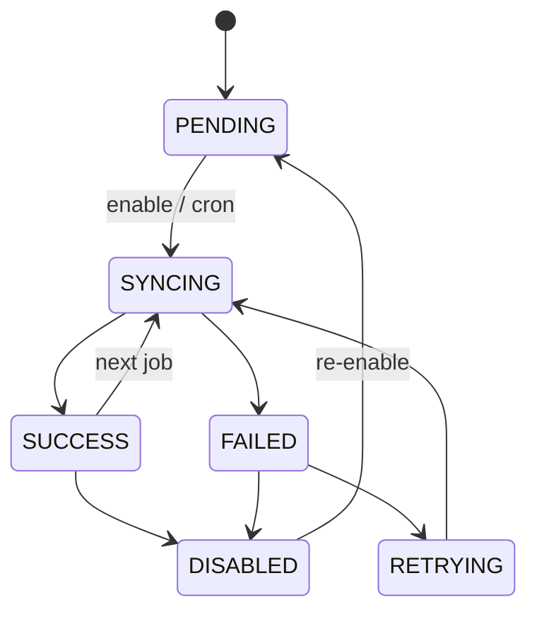

# ANIMAPS — Integrations (future)

Prepared architecture for institutional API, webhooks, import, and export. **Do not implement specific government integrations now** (no named prefeitura, SIS, protocol, or partner API in this pass).

Related: [government.md](../domains/government.md) · [case-routing.md](../domains/case-routing.md) · [audit.md](../security/audit.md) · [privacy.md](../security/privacy.md) · [api.md](../api/overview.md) · [security.md](../security/security.md).

**Status:** tables + states documented; Fase 8 web mock (`apps/web/src/features/institution/integrations/`). Wave 2 REST freeze stays identity + marketing + onboarding persist. Occurrence/adoption routes remain “later waves” in [api.md](../api/overview.md); Case/institution HTTP is even later. **Do not implement specific government integrations** (no named prefeitura, SIS, protocol, or partner API).

---

## Why prepare without building

Cities will ask to push/pull cases. If we wait, teams will hardcode a one-off. `integration_connections` + `integration_logs` + a **sync status** enum let us attach a connection when legal and operational agreements exist.

Internal [case-routing.md](../domains/case-routing.md) is **not** an integration.

---

## Future surfaces

| Kind | Direction | Notes |
|---|---|---|
| Institutional REST | In/out | Authenticated, scoped to one institution |
| Webhooks | ANIMAPS → partner | Signed payloads; case status, not full PII by default |
| Import | CSV / XLSX / API / DB dump | Job: validate → preview → errors → duplicates → commit |
| Export | CSV / XLSX / PDF / API | Who, which data, period, purpose; audit |
| Partner feed | In | `source = PARTNER` |

Permissions: `EXPORT_DATA`, future `MANAGE_INTEGRATION`. Public listings still omit secrets ([api.md](../api/overview.md)).

---

## Sync states

Every connection (and optionally every job) uses:

| Status | Meaning |
|---|---|
| `PENDING` | Configured, not live |
| `SYNCING` | Run in progress |
| `SUCCESS` | Last run ok |
| `FAILED` | Last run failed |
| `RETRYING` | Backoff in progress |
| `DISABLED` | Operator off |

Failed or disabled remote sync **must not** set citizen status to “delivered to the agency”. Routing inside ANIMAPS is independent.

---

## `integration_connections`

| Field | Notes |
|---|---|
| `id` | uuid |
| `institution_id` | Nullable if platform-level |
| `kind` | `api` · `webhook` · `import` · `export` · `partner` |
| `provider_key` | Stable slug (`generic_rest`, later a real vendor) — **no** vendor-specific rows required now |
| `status` | Enum above |
| `config` | jsonb **non-secret** (URLs, field maps). Secrets in a vault / encrypted column, never in audit |
| `api_key_hash` | If ANIMAPS issues inbound keys — hash only |
| `created_by_user_id` | |
| `created_at` / `updated_at` | |

Do not commit live credentials. `.env` / secret store only on `apps/api`.

---

## `integration_logs`

Append-ish operational log (retention shorter than legal audit if needed).

| Field | Notes |
|---|---|
| `connection_id` | |
| `direction` | `inbound` · `outbound` |
| `status` | `SUCCESS` · `FAILED` · `RETRYING` |
| `http_status` | Optional |
| `message` | Short; no payload dumps of PII |
| `external_id` | Partner correlation id |
| `case_id` | Optional |
| `created_at` | |

---

## Import jobs (prepared)

Pipeline: **IMPORT JOB → VALIDATION → PREVIEW → ERRORS → DUPLICATES → SYNC → HISTORY**. Store job status with the same sync enum. Duplicates should match `reference_number` / external id, not silently create double cases.

---

## Export

Formats later: CSV, XLSX, PDF, API. Controls: actor permission, classification ceiling, period, purpose. Every export writes `audit_logs` (`data_exported`) and optionally `data_exports` (who, filters, row counts — not the file contents).

Aggregates: city/neighborhood, not raw lat/lng ([lgpd-checklist.md](../security/lgpd-checklist.md)).

---

## Wave 2 API freeze

Do **not** add government endpoints to the Wave 2 identity contract. When Case/institution API exists, document them under “later waves” the same way occurrence routes are listed today — without breaking register/login/onboarding.

---

## Current vs future

| Current | Future |
|---|---|
| Web mock: generic connections + logs + aggregate export history (`localStorage`) | Nest module `integrations` + vault |
| In-process domain events only | Plus webhooks when a connection is enabled |
| No city / named gov API | Generic connector; specific gov adapters only with contract |

---

## Decision log

- Prepare connections, logs, and sync states; do not implement a specific government system now.
- Sync failure ≠ citizen “sent to the agency”.
- Secrets hashed/vaulted; logs without PII payloads.
- Import/export are job-shaped and audited.
