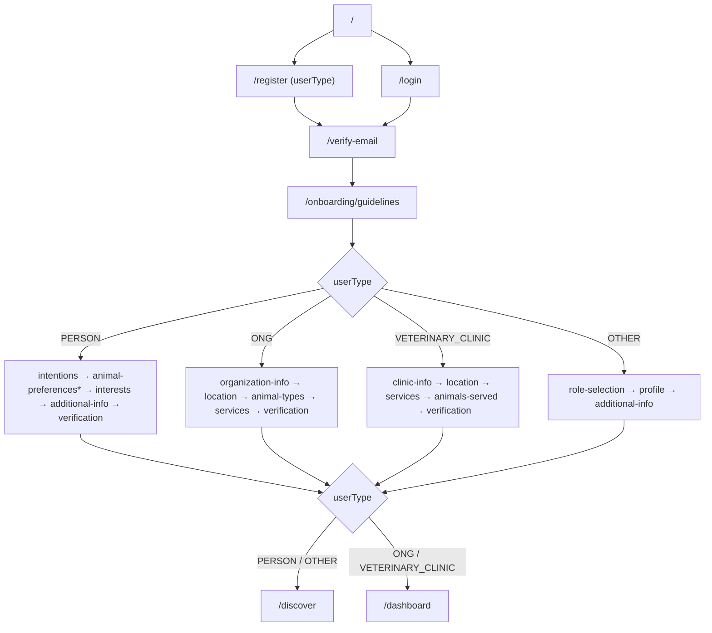

# ANIMAPS — User flow

End-to-end journey from first visit through dashboard. UX inspiration (progressive onboarding, preference cards, discovery) may resemble dating apps; **visual identity remains ANIMAPS** (pink/green, clay companions, professional trust).

Related: [onboarding.md](onboarding.md) · [user-types.md](../domains/user-types.md) · [authentication.md](authentication.md) · [verification.md](verification.md) · [dashboard.md](dashboard.md) · [conventions.md](../architecture/conventions.md).

---

## Happy path

User type is chosen on **`/register`** (step 1). It is stored in the onboarding draft as `userType` and drives the post-verification flow.

\* `animal-preferences` only when PERSON selected `adopt` in intentions.

---

## Optional / skippable steps

| Step | Required? | Notes |
|---|---|---|
| Email verification code | Yes (gate) | Mock today; Nest `identity` later |
| Community guidelines accept | Yes (gate) | All types |
| Type-specific required steps | Varies | e.g. `intentions`, `organization-info`, `clinic-info`, `role-selection` |
| Animal preferences | Conditional | PERSON + `adopt` only; skippable when shown |
| Interests (max 5) | Optional | PERSON |
| Additional info / profile | Optional | PERSON / OTHER |
| Location, services, animal-types | Optional | ONG / clinic |
| Verification | Soft gate | Selfie / institutional; can proceed with `pending` |

**Principle:** never force every field on first run. Draft persists in `localStorage` (`animaps-onboarding-draft`, includes `userType`).

---

## Route map (frontend)

| Route | Stage |
|---|---|
| `/` | Landing |
| `/register`, `/login` | Auth UI; register collects `userType` |
| `/verify-email` | Email OTP |
| `/onboarding/[step]` | Dynamic onboarding (`OnboardingFlow`) |
| `/onboarding/guidelines` | Universal first step |
| `/onboarding/intentions` | PERSON intentions |
| `/onboarding/animal-preferences` | PERSON adopt prefs (conditional) |
| `/onboarding/organization-info` | ONG org data |
| `/onboarding/clinic-info` | Clinic data |
| `/onboarding/role-selection` | OTHER role picker |
| `/onboarding/verification` | Verification (types that include it) |
| `/dashboard` | Home shell (ONG / clinic); PERSON → redirect |
| `/discover` | Card discovery (PERSON / OTHER primary home) |

Legacy aliases: `/onboarding/intention` → intentions; `/onboarding/animal-type|animal-size|preferences` still work via composite step.

Documented, not built yet: `/animals`, `/matches`, `/messages`, `/reports`, `/favorites`, `/profile`, `/settings`, `/adoption-requests`, `/volunteers`, `/donations`, `/organization`, `/services`, `/location`, `/reviews`.

Messages, donations, reviews, and volunteers have **no schema** yet — keep as “coming soon”. Favorites map to `animal_favorites`.

---

## Current vs future

| Concern | Current (frontend-only) | Future (Wave 2+) |
|---|---|---|
| Persistence | `localStorage` draft + mocks | Nest `PUT /me/onboarding` ([api.md](../api/overview.md) · [database.md](../database/overview.md)) |
| Email code | Simulated send/verify | `EmailVerificationToken` + rate limits |
| Selfie | Simulated async status | Verification provider + `verification_requests` |
| Matching | UI mocks only | Compatibility service in `adoption` |

---

## Decision log

- Flat routes (`/verify-email`, not `/auth/verify-email`) to stay consistent with existing `/register` and `/login`.
- **Single dynamic onboarding route** (`/onboarding/[step]`) replaces a fixed guardian-only chain.
- **userType at register** — no separate onboarding type picker after verify.
- Dashboard entry differs by type: PERSON/OTHER → discover; ONG/clinic → dashboard shell.
